# Build a Full Stack AI Note Taking App with Next.js and Supabase – Tutorial
## goat-notes

[](https://www.youtube.com/watch?v=6ChzCaljcaI&t=164s)

[](https://www.youtube.com/@coleblender)

## 1. Intro (0:00:00)

1. Instalar `NODEJS` y `npm` en su sistema, usando el `nvm`:
  [Instalar múltiples versiones de Node.js en Windows](https://rafaelneto.dev/blog/instalar-multiples-versiones-nodejs-windows/).
```bash
   nvm install [version]
   nvm use [version]
```
2. Verificar las versiones de `NODEJS` instaladas en una `TERMINAL`:
 ```bash
   nvm list
 ```
3. Instalar también el `pnpm` [pnpm installation](https://pnpm.io/installation), es mas rápido que el  `npm`.
4. Instalar [Visual Studio Code](https://code.visualstudio.com/insiders/).

## 2. Start Project (0:02:44)

1. En una `TERMINAL`, ejecutar el comando:
```bash
pnpm dlx create-next-app@latest goat-notes
```
* Responder a las solictudes de la siguiente manera:
```bash
Packages: +1
+
Progress: resolved 1, reused 0, downloaded 1, added 1, done
? Would you like to use TypeScript? » No / Yes <- Yes
? Would you like to use ESLint? » No / Yes -> Yes
? Would you like to use Tailwind CSS? » No / Yes <- Yes
? Would you like your code inside a `src/` directory? » No / Yes <- Yes
? Would you like to use App Router? (recommended) » No / Yes <- Yes
? Would you like to use Turbopack for `next dev`? ... No / Yes <- Yes
? Would you like to customize the import alias (`@/*` by default)? » No / Yes <- No
```
* Hace el proceso de instalación y listo:
```bash
Creating a new Next.js app in e:\tutorials\nodejs\goat-notes.

Using pnpm.

Initializing project with template: app-tw


Installing dependencies:
- react
- react-dom
- next

Installing devDependencies:
- typescript
- @types/node
- @types/react
- @types/react-dom
- @tailwindcss/postcss
- tailwindcss
- eslint
- eslint-config-next
- @eslint/eslintrc
```
2. Cambiamos al directorio que acaba de crear y ejecutamos el comando para inicalizar `Visual Studio Code`:
```bash
cd goat-notes
code .
```
>[!NOTE]  
>Este es el contenido del **`README.md`** que deja:
>```r
>This is a [Next.js](https://nextjs.org) project bootstrapped with [`create-next-app`](https://nextjs.org/docs/app/api-reference/cli/create-next-app).
>
>## Getting Started
>
>First, run the development server:
>
>/```bash
>npm run dev
># or
>yarn dev
># or
>pnpm dev
># or
>bun dev
>/```
>
>Open [http://localhost:3000](http://localhost:3000) with your browser to see the result.
>
>You can start editing the page by modifying `app/page.tsx`. The page auto-updates as you edit the file.
>
>This project uses [`next/font`](https://nextjs.org/docs/app/building-your-application/optimizing/fonts) to automatically optimize and load [Geist](https://vercel.com/font), a new font family for Vercel.
>
>## Learn More
>
>To learn more about Next.js, take a look at the following resources:
>
>- [Next.js Documentation](https://nextjs.org/docs) - learn about Next.js features and API.
>- [Learn Next.js](https://nextjs.org/learn) - an interactive Next.js tutorial.
>
>You can check out [the Next.js GitHub repository](https://github.com/vercel/next.js) - your feedback and contributions are welcome!
>
>## Deploy on Vercel
>
>The easiest way to deploy your Next.js app is to use the [Vercel Platform](https://vercel.com/new?utm_medium=default-template&filter=next.js&utm_source=create-next-app&utm_campaign=create-next-app-readme) from the creators of Next.js.
>
>Check out our [Next.js deployment documentation](https://nextjs.org/docs/app/building-your-application/deploying) for more details.
>```

>[!NOTE]  
>Este es el contenido del **`.gitignore`**, que aperece:
>```yml
># See https://help.github.com/articles/ignoring-files/ for more about ignoring files.
>
># dependencies
>/node_modules
>/.pnp
>.pnp.*
>.yarn/*
>!.yarn/patches
>!.yarn/plugins
>!.yarn/releases
>!.yarn/versions
>
># testing
>/coverage
>
># next.js
>/.next/
>/out/
>
># production
>/build
>
># misc
>.DS_Store
>*.pem
>
># debug
>npm-debug.log*
>yarn-debug.log*
>yarn-error.log*
>.pnpm-debug.log*
>
># env files (can opt-in for committing if needed)
>.env*
>
># vercel
>.vercel
>
># typescript
>*.tsbuildinfo
>next-env.d.ts
>```
> Se procede a unir con el **`.gitignore`** existente.

3. Puedo ejecutar y ver en el browser lo que va hasta el momento:
```bash
pnpm dev
```
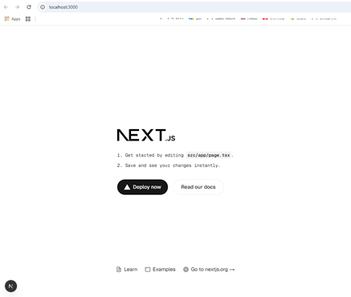

4. Abrimos **`layout.tsx`**, y removemos del `return`, el `className`
del `<body>`.
5. Borramos las constantes para definir los tipos de letras de
 `geistSans` y `geistMono`.
6. Borramos la importación de:  
`import { Geist, Geist_Mono } from "next/font/google";`.
7. Cambio el `title:` a `GOAT Notes` y el `description:` a
`Build a Full Stack AI Note Taking App with Next.js and Supabase – Tutorial`.
8. En el archivo **`layout.tsx`**, presiono las teclas `[Shift]`
+`[Alt]`+`[F]`

>[!TIP]  
>Si lo anterior no funciona, para _formatear_ el código, tambíen se 
>puede con las teclas `[Shif]`+`[Ctrl]`+`[p]` y escribe o busca
>`Format Document`.

* Así se ve el código de **`layout.tsx`**:
```js
import type { Metadata } from 'next';
import './globals.css';

export const metadata: Metadata = {
  title: 'GOAT Notes',
  description:
    'Build a Full Stack AI Note Taking App with Next.js and Supabase – Tutorial',
};

export default function RootLayout({
  children,
}: Readonly<{
  children: React.ReactNode;
}>) {
  return (
    <html lang='en'>
      <body>{children}</body>
    </html>
  );
}
```
9. Abrimos el archivo **`page.tsx`**, borramos todo y lo sustituimos
por el _snippet_ de `rfce`:
```js
import React from 'react';

function page() {
  return <div>page</div>;
}

export default page;
```
10. Cambiamos en las tres(3) veces que dice  `page` por `HomePage`.
11. Creamos la carpeta **"styles"**, dentro de **"src"**.
12. Movemos el archivo **`global.css`** a la nueva carpeta

>[!WARNING]  
>Acá va a generarse un error, enseguida lo vamos a corregir.

13. De regreso al archivo **`layout.tsx`**, hacemos la corrección:
```js
import '../styles/globals.css';
```
o esta:
```js
import '@/styles/globals.css';
```
14. Removemos los cinco(5) archivos de la carpeta **"public"**. 
15. En la carpeta **"public"**, agregamos el archivo 
[github->**`goatius.png`**](https://github.com/ColeBlender/goat-notes/blob/main/public/goatius.png).
16. Tambien borramos el archivo **`favicon.ico`**.
17. Y ponemos en la carpeta **"app"** el archivo 
[github->**`favicon.ico`**](https://github.com/ColeBlender/goat-notes/blob/main/src/app/favicon.ico).
18. Agregamos en una `TERMINAL` el `tailwind` en modo _desarrollo_:
```bash
pnpm add -D -E prettier prettier-plugin-tailwindcss
```
Respuesta esperada en mi ambiente y en la fecha de hoy:
```bash
devDependencies:
+ prettier 3.5.3
+ prettier-plugin-tailwindcss 0.6.11

╭ Warning ───────────────────────────────────────────────────────────────────────────────────╮
│                                                                                            │
│   Ignored build scripts: sharp.                                                            │
│   Run "pnpm approve-builds" to pick which dependencies should be allowed to run scripts.   │
│                                                                                            │
╰────────────────────────────────────────────────────────────────────────────────────────────╯
```

>[!TIP]  
>### Abrir el archivo **`package.json`** y borra todos los _carets_ (`^`).

19. En la raíz del proyecto, creamos el achivo **`.prettierrc`**, con
este código:
```json
{
  "plugins": ["prettier-plugin-tailwindcss"]
}
```

>[!IMPORTANT]  
>Solo a modo de prueba inserta esto en el archivo **`page.tsx`**, en
>el elemento `<div>`
>```js
>function HomePage() {
>  return <div className='h-20 bg-red-400 text-blue-300'>HomePage</div>;
>}
>```
>* Y mira como cambia lo visto en el browser.  
>* Luego lo dejas como como estaba.

20. Abre el archivo **`eslint.config.mjs`** y le agregas esta regla:
```js
...
const eslintConfig = [
  ...compat.extends("next/core-web-vitals", "next/typescript"),
  {
    rules: {
      "react/no-unescaped-entities": "off",
    },
  }
];
...
```
>[!NOTE]  
>Requerido para que cuando se despliegue en `VERCEL`, no genere errores
>al usar caracteres especiales.

## 3. Add shacn/ui, Dark Mode, and Toast (0:06:48)

1. De este sitio [shadcn/ui](https://ui.shadcn.com/docs/installation/next),
copiamos el comando para ejecutar en una `TERMINAL`:
```bash
pnpm dlx shadcn@latest init
```
Seleccionamos lo siguiente:
* Neutral

2. De este sitio [Dark mode](https://ui.shadcn.com/docs/dark-mode/next),
copiamos el comando para ejecutar en una `TERMINAL`: 
```bash
pnpm add next-themes
```
3. Creamos la carpeta **"providers"** dentro de **"src"**.
4. Dentro de esta nueva carpeta creamos el archivo 
**`ThemeProvider.tsx`** y copiamos este código del sitio anterior:
```js
"use client"

import * as React from "react"
import { ThemeProvider as NextThemesProvider } from "next-themes"

export function ThemeProvider({
  children,
  ...props
}: React.ComponentProps<typeof NextThemesProvider>) {
  return <NextThemesProvider {...props}>{children}</NextThemesProvider>
}
```
5. Copiamos esto del mismo sitio, en el archivo **`layout.tsx`**, 
y debe quedar así:
```js
import type { Metadata } from "next";
import "@/styles/globals.css";
import { ThemeProvider } from "@/providers/ThemeProvider";
...
export default function RootLayout({
  children,
}: Readonly<{
  children: React.ReactNode;
}>) {
  return (
    <html lang="en" suppressHydrationWarning>
      <head />
      <body>
        <ThemeProvider
          attribute="class"
          defaultTheme="system"
          enableSystem
          disableTransitionOnChange
        >
          {children}
        </ThemeProvider>
      </body>
    </html>
  );
}
```

>[!TIP]  
>Se sugiere detener el proceso de `pnpm dev` y volverlo a ejecutar

6. De este sitio [Toast](https://ui.shadcn.com/docs/components/toast),
copiamos el comando para ejecutar en una `TERMINAL`:
```bash
pnpm dlx shadcn@latest add toast
```

>[!WARNING]  
>Sale esta advertencia:  
>`The toast component is deprecated. Use the sonner component instead.`
>
>Debo ejecutar en vez del anterior, el que si funciona, copiándolo
> de este sitio [sonner](https://ui.shadcn.com/docs/components/sonner):
>```bash
>pnpm dlx shadcn@latest add sonner
>```

7. Volvemos al arhivo **`layout.tsx`** y ponemos el rederizado o 
llamoado a `<Toaster/>` dentro del `<ThemeProvider`, y luego
la respectiva importación:  
`import { Toaster } from "@/components/ui/sonner";`

## 4. Build Header (0:08:48)

1. Creamos en la carpeta **"src/components"** el archivo **`Header.tsx`**
y le escribimos el _snippet_ de `rfce`:
```js
import React from "react";

function Header() {
  return <div>Header</div>;
}

export default Header;
```
>[!TIP]  
>Estos _snippet_ se logran por que en `Visual Studio Code` se tiene 
>instalada en `Extensions`  el `Simple React Snippets` de `Burke Holland`.

2. Cambiamos en el código el elemento `<div` por `<header`.
3. Cambio el código de **`Header.tsx`**, por esto:
```js
import Link from "next/link";
import Image from "next/image";

function Header() {
  return (
    <header>
      <Link href="/">
        <Image 
        src="/goatius.png"
        height={60}
        width={60} 
        alt="logo" 
        className="rounded-full"
        priority/>
      </Link>
    </header>
  );
}

export default Header;
```
4. Lo renderizamos o llamamos en el archivo **`layout.tsx`**, justo
antes de `{children}`, y tambien hacer la importación:
```js
...
import Header from "@/components/Header";
...
export default function RootLayout(...) {
  return (
    <html lang="en" suppressHydrationWarning>
      <head />
      <body>
        <ThemeProvider{/* mas propiedades */}> 
          <Header />
          {children}
          <Toaster />
        </ThemeProvider>
      </body>
    </html>
  );
}
```
* Así se ve hasta el momento el browser:  
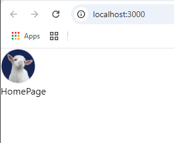

5. En el archivo **`layout.tsx`**, encerramos el `<Header` y el
`{children}`, dentro de un elemento `<div>`, con un `className`:
```js
          <div className="flex min-h-screen w-full flex-col">
            <Header />
            {children}
          </div>
```
6. Encierro entre un elemento `<main` a `{children}` con un `className`:
```js
            <main className="flex flex-1 flex-col px-4 pt-10 xl:px-8">
              {children}
            </main>
```
7. Regreso al archivo **`Header.tsx`** y agrego un `className`y un
`style` al elemento `<header`:
```js
    <header
      className="bg-popover relative flex h-24 w-full items-center justify-between px-3 sm:px-8"
      style={{
        boxShadow: shadow,
      }}
    >
      ...
    </header>
```
>[!WARNING]  
>Sale un error en `shadow`, mas adelante se hará el arreglo.

8. En la carpeta **"src/styles"**, agreo el archivo **`utils.ts`**, con 
este código:
```js
const glowColor = "rgba(59, 130, 246, 0.3)";

export const shadow = `0 0 5px ${glowColor}, 0 0 10px ${glowColor}, 0 0 15px ${glowColor}, 0 0 20px ${glowColor}`;
```
9. Regreso a **`Header.tsx`** y añado la importación del nuevo archivo
de **`utils.ts`**:
```js
import { shadow } from "@/styles/utils";
```
* Así se ve el browser, hasta el momento:  
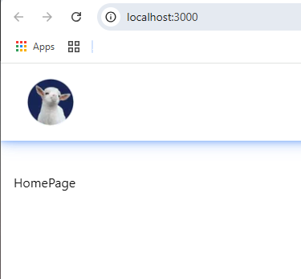

10. Agrego un `<h1>`, conteniendo un `<span>`, justo debajo del elemento
`<Image`:
```js
        <h1 className="flex flex-col pb-1 text-2xl leading-6 font-semibold">
          GOAT <span>Notes</span>
        </h1>
```
11. Agrego un elemento `<div>` debajo del que cierra `</Link>`:
```js
      <div className="flex gap-4"></div>
```
12. Creo una constante `user` y la inicializo con `null` al inicio de
la función `Header()`:
```js
  const user = null;
```
13. Al momento de renderizar `<Link` le ponemos una `className`:
```js
      <Link className="flex items-end gap-2" href="/">
        ...
      </Link>
```
14. Dentro de este nuevo `<div`, hacemos uso de `user`:
```js
      <div className="flex gap-4">{user ? "logout" : <></>}</div>
```
15. De este sitio [Button](https://ui.shadcn.com/docs/components/button),
copiamos el comando para ejecutar en una `TERMINAL`:
```bash
pnpm dlx shadcn@latest add button
```
16. En medio del elemento vacío de `<>`, agrego el renderizado o 
llamado al componente `<Button>`, y por ende la importación:
```js
...
import { Button } from "./ui/button";

function Header() {
  ...
  return (
    <header {/* Propiedades */}>
      <Link {/* Propiedades */}>
        ...
      </Link>

      <div {/* Propiedades */}>
        {user ? (
          "logout"
        ) : (
          <>
            <Button></Button>
          </>
        )}
      </div>
    </header>
  );
}
```
18. Dentro del renderizado de `<Button` agregamos un `<Link`:
```js
            <Button>
              <Link href="/login">Login</Link>
            </Button>
```
19. A `<Button` le agregamos la propiedad `asChild`.
20. Copio este `<Button` y cambio el contenido por `/Sign-up` y `Sign Up`:
```js
      <div className="flex gap-4">
        {user ? (
          "logout"
        ) : (
          <>
            <Button asChild>
              <Link href="/sign-up">Sign Up</Link>
            </Button>
            <Button asChild>
              <Link href="/login">Login</Link>
            </Button>
          </>
        )}
      </div>
```
21. Al `<Button` de `Login` le agrego como propiedad `variant="outline"`.
22. Al `<Link` de `Sign Up` le agrego un `className`:
```js
      <div className="flex gap-4">
        {user ? (
          "logout"
        ) : (
          <>
            <Button asChild>
              <Link href="/sign-up" className="hidden sm:block">
                Sign Up
              </Link>
            </Button>
            <Button asChild variant="outline">
              <Link href="/login">Login</Link>
            </Button>
          </>
        )}
      </div>
```
23. En la carperta **"src/components"**, creo el archivo de nombre
**`DarkModeToggle.tsx`**.
24. Del sitio [Dark mode](https://ui.shadcn.com/docs/dark-mode/next), busco el paso `4.` y doy click en `Code`, para copiar el contenido y 
llevarlo al archivo nuevo.
25. Hago unos ajustes para que el nombre de la función sea
`DarkModeToggle()` y la exportación por defecto al final:
```js
"use client";

import * as React from "react";
import { Moon, Sun } from "lucide-react";
import { useTheme } from "next-themes";

import { Button } from "@/components/ui/button";
import {
  DropdownMenu,
  DropdownMenuContent,
  DropdownMenuItem,
  DropdownMenuTrigger,
} from "@/components/ui/dropdown-menu";

function DarkModeToggle() {
  const { setTheme } = useTheme();

  return (
    <DropdownMenu>
      <DropdownMenuTrigger asChild>
        <Button variant="outline" size="icon">
          <Sun className="h-[1.2rem] w-[1.2rem] scale-100 rotate-0 transition-all dark:scale-0 dark:-rotate-90" />
          <Moon className="absolute h-[1.2rem] w-[1.2rem] scale-0 rotate-90 transition-all dark:scale-100 dark:rotate-0" />
          <span className="sr-only">Toggle theme</span>
        </Button>
      </DropdownMenuTrigger>
      <DropdownMenuContent align="end">
        <DropdownMenuItem onClick={() => setTheme("light")}>
          Light
        </DropdownMenuItem>
        <DropdownMenuItem onClick={() => setTheme("dark")}>
          Dark
        </DropdownMenuItem>
        <DropdownMenuItem onClick={() => setTheme("system")}>
          System
        </DropdownMenuItem>
      </DropdownMenuContent>
    </DropdownMenu>
  );
}

export default DarkModeToggle;
```
>[!WARNING]  
>Tenemos un error en la importación de `"@/components/ui/dropdown-menu"`,
>ya veremos como se soluciona.

26. De este sitio [Dropdown Menu](https://ui.shadcn.com/docs/components/dropdown-menu),
copiamos el comando para ejecutar en una `TERMINAL`:
```bash
pnpm dlx shadcn@latest add dropdown-menu
```
27. En el archivo **`Heaeder.tsx`**, hacemos el renderizado o llamado al
componente `<DarkModeToggle`, antes de cerrar `</div>`, y por
ende la importación.

Así finalmente luce el browser con los tres botónes:  
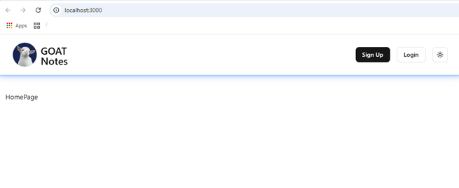

>[!TIP]  
>### Abrir el archivo **`package.json`** y borra todos los _carets_ (`^`).

## 5. Build LogOutButton (0:17:21)

1. Creamos en la carpeta **"src/components"**, el archivo de
nombre **`LogOutButton.tsx`** y le ponemos el _snippet_ de `rfce`:
```js
import React from "react";

function LogOutButton() {
  return <div>LogOutButton</div>;
}

export default LogOutButton;
```
2. En el archivo **`Header.tsx`**, cambiamos el texto de `"logout"`,
por el renderizado del `<LogOutButton/>`, tambien añadimos la 
importación.
3. Regresando **`LogOutButton.tsx`**, completamos el código con
componentes como `<Button` y las importaciones faltantes:
```js
import { Button } from "./ui/button";
import { Loader2 } from "lucide-react";

function LogOutButton() {
  useState
  return (
    <Button>
      {loading ? <Loader2 className="animate-spin" /> : <span>Log Out</span>}
    </Button>
  );
}
```
4. Definimos la constante `loading` como un `useState`, dentro de la 
función `LogOutButton()`:
```js
  const [loading, setloading] = useState(false);
```
5. En el tope del código añadimos `"use client";`.
6. Para verificar el nuevo botón `Log Out`, en el archivo 
**`Header.txt`**, cambiamos el `const user = null;`, 
por `const user = 1;`.
* Así se ve en el browser:  
![localhost:3000 -> [Log Out]](images/2025-03-20_171745.png "localhost:3000 -> [Log Out]")
7. Volvemos al archivo **`LogOutButton.tsx`** y al renderizado de 
`<Button`, le agrego `variant`, `onClick`, `className` y
`disabled`:
```js
    <Button
      variant="outline"
      onClick={handleLogOut}
      className="w-24"
      disabled={loading}
    >
      {loading ? <Loader2 className="animate-spin" /> : <span>Log Out</span>}
    </Button>
```
8. Agregamos la función faltante de `handleLogOut()`:
```js
  function handleLogOut() {
    console.log("Logging out...");
  }
```
9. Mejoramos la función `handleLogOut()`, haciéndola asincrónica y
los respectivos elementos:
```js
  async function handleLogOut() {
    setloading(true);
    await new Promise((resolve) => setTimeout(resolve, 1000));
    setloading(false);
  }
```
* Si le damos clic al botón aparece la imagen del _spin_.
10. Definimos un `{toast}` usando el _hook_ `useToast()`, 
que debe importarse de `'@/hooks/use-toast'`:
```js
import { useToast } from "@/hooks/use-toast";

function LogOutButton()  {
  const {toast} = useToast();

  ...
}
```

>[!WARNING]  
>Nos aparece un error en la importación del _hook_ `{ useToast }`,
>entonces creamos la carpeta **"src/hooks"** y descargamos el archivo 
>[**`use-toast.ts`**](https://github.com/ColeBlender/goat-notes/blob/main/src/hooks/use-toast.ts) del instructor.

>[!WARNING]  
>Reviso el archivo descargado de **`use-toast.ts`** y tengo un error
>pide el componente `toast.tsx`, entonces tocará descargarlo de
>[**`toaster.tsx`**](https://github.com/ColeBlender/goat-notes/blob/main/src/components/ui/toaster.tsx) y
>[*`toast.tsx`**](https://github.com/ColeBlender/goat-notes/blob/main/src/components/ui/toast.tsx), para ponerlos en la 
>carpeta **"src/components/ui"**
11. Seguimos en **`LogOutButton.tsx`**, ye en la función `handleLogOut()`
ponemos la constante `errorMessage` y la usamos en un condicional:
```js
    const errorMesage = null;
    if (!errorMesage) {
      toast({
        title: "Logged Out",
        description: "You have been successfully logged out",
        variant: "success",
      });
    }
```
12. Verificamos el archivo **`toast.tsx`**, como dice el instructor,
en la constante `toastVariants`, que si exista en `variant`,
el valor de :  
`success: "bg-emerald-700",`.
13. En el archivo **`LogOutButton.tsx`**, definimos el _hook_
`useRouter` y lo importamos:
```js
...
import { useRouter } from "next/navigation";

function LogOutButton()  {
  ...
  const router = useRouter();
  ...
}
```
14. Completamos el condicional de `(!errorMesage)`con el `router`
y el `else`:
```js
    if (!errorMesage) {
      toast({
        title: "Logged Out",
        description: "You have been successfully logged out",
        variant: "success",
      });
      router.push("/");
    } else {
      toast({
        title: "Error",
        description: errorMesage,
        variant: "destructive",
      });
    }
```
15. En el archivo **`layout.tsx`**, cambio la importación de
`Toaster` por:
```js
import { Toaster } from "@/components/ui/toaster";
```
>[!WARNING]  
>Sigo hallando errores en el archivo **`toast.tsx`**, relacionado con
>`"@radix-ui/react-toast";`, entonces abro el archivo **`package.json`**
> y añado esto en las `"dependencies:"` -> 
>`"@radix-ui/react-toast": "1.2.5",`,
>paro el proyecto, escribo el comando en la `TERMINAL`
>```bash
>pnpm i
>```
> y reinicio el proyecto con `pnpm dev`.

16. Pruebo con el botón de `[Log Out]` y aparece el mensaje verde en la
parte inferior:  
![[Log Out] -> success](images/2025-03-20_184302.png "[Log Out] -> success")
17. En el archivo **`LogOutButton.tsx`**, cambiamos la definición
de la constante `errorMesage` por `"Error logging out"`, 
presionamos el botón de `[Log Out]`:  
![[Log Out] -> destructive](images/2025-03-20_184802.png "[Log Out] -> destructive")
18. Regresamos el valor de la constante `errorMesage` a `null`.


## 6. Add Auth Pages (0:22:19)

1. En la carpeta **"src/app"**, creamos la carpea **"login"** y dentro el 
archivo **`page.tsx`**, y completamos con el _snippet_ `rfce`:
```js
import React from "react";

function page() {
  return <div>page</div>;
}

export default page;
```
2. Cambiamos todo lo que diga `page` por `LoginPage`.
3. Podemos probar simplemente agregando a la ruta o `URL` la palabra
`/login`:  
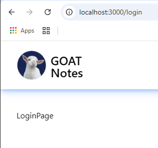
4. Al elemento `<div` le agrego un `className`:
```js
function LoginPage() {
  return (
    <div className="mt-20 flex flex-1 flex-col items-center">LoginPage</div>
  );
}
```
5. Del sitio [Card](https://ui.shadcn.com/docs/components/card),
copiamos el comando para ejecutar en una `TERMINAL`:
```bash
pnpm dlx shadcn@latest add dropdown-menu
```
```bash
pnpm dlx shadcn@latest add card
```
6. Renderizamos este nuevo componente en vez del texto entre el elemento
`<div`, también lo debemos importar:
```js
import { Card } from "@/components/ui/card";
...
function LoginPage() {
  return (
    <div className="mt-20 flex flex-1 flex-col items-center">
      <Card></Card>
    </div>
  );
}
```
7. Agregamos un `className` al nuevo renderizado de `<Card`:
```js
      <Card className="w-full max-w-md"></Card>
```
8. Agregamos en medio del renderizado de `<Card` el elemento
`<CardHeader`, por ende se añade a la importación de `Card`.
9. Al elemento `<CardHeader` le agregamos un `className`:
```js
      <Card className="w-full max-w-md">
        <CardHeader className="mb-4"></CardHeader>
      </Card>
```
10. Dentro de `<CardHeader`, renderizamos `<CardTitle` y le ponemos
en medio la palabra `Login`, también se debe añadir en la importación:
```js
      <Card className="w-full max-w-md">
        <CardHeader className="mb-4">
          <CardTitle>Login</CardTitle>
        </CardHeader>
      </Card>
```
11. Ponemos un `className` al elemento `<CardTitle`:
```js
          <CardTitle className="text-center text-3xl">Login</CardTitle>
```
12. Creamos en la carpeta **"src/components"**, el archivo 
**`AuthForm.tsx`**, le ponemos el _snippet_ `rfce`:
```js
import React from "react";

function AuthForm() {
  return <div>AuthForm</div>;
}

export default AuthForm;
```
13. Regresamos al archivo **`page.tsx`** de la carpeta **"src/app/login"**, renderizamos el nuevo componente `AuthForm`
debajo del cierre de `</CardHeader`, y añadimos la respectiva importación:
```js
import AuthForm from "@/components/AuthForm";
...

function LoginPage() {
  return (
    <div className="mt-20 flex flex-1 flex-col items-center">
      <Card className="w-full max-w-md">
        <CardHeader className="mb-4">
          ...
        </CardHeader>

        <AuthForm />
      </Card>
    </div>
  );
}
```
14. Le ponemos una propiedad a `AuthForm` de nombre `type`:
```js
        <AuthForm type="login"/>
```
>[!WARNING]  
>El error sale porque falta que el archivo **`AuthForm.tsx`**, 
> se reciba y defina esa propiedad o parámetro.
15. De regreso al archivo **`AuthFrom.tsx`**, definimos un `type`
llamado `Props`:
```js
type Props ={
  type: "login" | "signUp";
}
```
16. Ponemos este parámetro o propiedad en la función `AuthForm()`:
```js
function AuthForm({ type }: Props) {
  return <div>AuthForm</div>;
}
```
17. En el tope de **`AuthFrom.tsx`** le ponemos la directiva 
`"use client"`, para que se renderice en el lado del cliente.
18. Añado una constante de nombre `isLoginForm`, dentro de la
función `AuthForm()`:
```js
  const isLoginForm = type === "login";
```
19. Añadimos una constante `router`, de tipo `useRouter`, por ende
debemos importar de `"next/navigation"`:
```js
import { useRouter } from "next/navigation";
...
function AuthForm({ type }: Props) {
  ...
  const router = useRouter();
  ...
}
```
20. Defino otra constante `{toast}` de `useToast()`, por ende también hago la importación de: `"@/hooks/use-toast"`.
21. Creamos la función `handleSubmit()`:
```js
  function handleSubmit(formData: FormData) {
    console.log("formData", formData);
  }
```
22. En el `return` de la función `AuthForm()`, hacemos unos
cambios:
```js
  return <form action={handleSubmit}>AuthForm</form>;
```
23. Cambiamos el texto en medio de `<form` por el renderizado de
`<CardContent`, con la respectiva importación de `"./ui/card"`.
24. Añado en medio del `<CardContent` un elemento `<div`:
25. Del sitio [Label](https://ui.shadcn.com/docs/components/label),
copiamos el comando para ejecutar en una `TERMINAL`:
```bash
pnpm dlx shadcn@latest add label
```
26. Completamos el contenido del `<div` con un `<Label`, que también
debe importarse de `"./ui/label"`:
```js
    <form action={handleSubmit}>
      <CardContent>
        <div>
          <Label htmlFor="email">Email</Label>
        </div>
      </CardContent>
    </form>
```
27. Del sitio [Input](https://ui.shadcn.com/docs/components/input),
copiamos el comando para ejecutar en una `TERMINAL`:
```bash
pnpm dlx shadcn@latest add input
```
28. Debajo del `<Label`, ponemos un `<Input` y hacemos la respectiva 
importación de `"./ui/input"`:
```js
          <Input id="email" name="email" placeholder="Enter your email" type="email" required />
```
29. Añadimos al `<Input` del `email` una propiedad `disabled` que
depende de `isPending`, que lo debemos definir antes con el _hook_
`useTransition`:
```js
...
import React, { useTransition } from "react";
...
function AuthForm({ type }: Props) {
  ...
  const [isPending, startTransition] = useTransition();
  ...
  return (
    <form action={handleSubmit}>
      <CardContent>
        <div>
          <Label htmlFor="email">Email</Label>
          <Input ... disabled={isPending}
          />
        </div>
      </CardContent>
    </form>
  );
}
```
30. Al elemento `<div` del archivo **`AuthFrom.tsx`**, le agregamos un
`className`:
```js
        <div className="flex flex-col space-y-1.5">
```
31. Clonamos todo el elemento `<div`, abajo y le hacemos unos cambios:
```js
        <div className="flex flex-col space-y-1.5">
          <Label htmlFor="password">Password</Label>
          <Input
            id="password"
            name="password"
            placeholder="Enter your password"
            type="password"
            required
            disabled={isPending}
          />
        </div>
```
32. Añadimos un `className` al renderizado del componente `<<CardConten`:
```js
      <CardContent className="grid w-full items-center gap-4">
```

>[!TIP]  
>Aquí el instructor sugiere tener instalada la extensión 
>`Multiple cursor case preserve` de `Cardinal90`, respetando el
>_camelCase_ o las _MAYÚSCULAS_ o _minúsculas_.

33. Añadimos otro renderizado o llamado de nombre `<CardFooter`,
junto con la importación de `"./ui/card"`, con al menos un
`<Button` adentro, este de los componentes ya importados de 
[`Button`](https://ui.shadcn.com/docs/components/button):
```js
import { CardContent, CardFooter } from "./ui/card";
...
import { Button } from "./ui/button";
...
function AuthForm({ type }: Props) {
  ...
  return (
    <form action={handleSubmit}>
      <CardContent className="grid w-full items-center gap-4">
        ...
      </CardContent>
      <CardFooter>
        <Button></Button>
      </CardFooter>
    </form>
  );
}
```
34. Al componente `<Button` le añado un condicional ternario, que incluye un componente `<Loader2` de `"lucide-react"`:
```js
        <Button>
          {isPending ? (
            <Loader2 className="animate-spin" />
          ) : isLoginForm ? (
            "Login"
          ) : (
            "Sign Up"
          )}
        </Button>
```
* Así se ve el aplicativo en el browser:
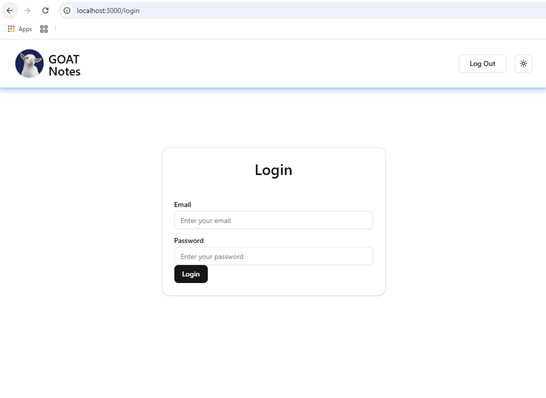
35. Cuando renderiza el `<Button` le agrego un `className`:
```js
        <Button className="w-full">
```
36. Al renderizar el `<CardFooter` otro `className`:
```js
      <CardFooter className="mt-4 flex flex-col gap-6">
```
37. Debajo del cierre del `</Button>`, agrego un elemento `<p>`
con un `ClassName` y un condicional ternario:
```js
        <p className="text-xs">
          {isLoginForm
            ? "Don't have an account yet?"
            : "Already have an account?"}{" "}
        </p>
```
38. Antes del cierre de `</p>`, renderizamos un `<Link`, con un 
condicional ternario para el `className` y otro para lo que se
muestra, agregamos la importación de `"next/link"` para `Link`:
```js
        <p className="text-xs">
          {isLoginForm
            ? "Don't have an account yet?"
            : "Already have an account?"}{" "}
          <Link
            href={isLoginForm ? "/sign-up" : "/login"}
            className={`text-blue-500 underline ${isPending ? "pointer-events-none opacity-50" : ""}`}
          >
            {isLoginForm ? "Sign Up" : "Login"}
          </Link>
        </p>
```
* Así se ve la página del Login en el browser:  
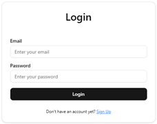
39. Creamos otro archivo de nombre **`sign-up/page.tsx`**,
en la carpeta **"src/app"** y le copiamos todo lo del 
**`login/page.tsx`**, con algunos cambios:
```js
import AuthForm from "@/components/AuthForm";
import { Card, CardHeader, CardTitle } from "@/components/ui/card";
import React from "react";

function SignUpPage() {
  return (
    <div className="mt-20 flex flex-1 flex-col items-center">
      <Card className="w-full max-w-md">
        <CardHeader className="mb-4">
          <CardTitle className="text-center text-3xl">Sign Up</CardTitle>
        </CardHeader>

        <AuthForm type="signUp" />
      </Card>
    </div>
  );
}

export default SignUpPage
```

### Actividad final con el link inferior:  
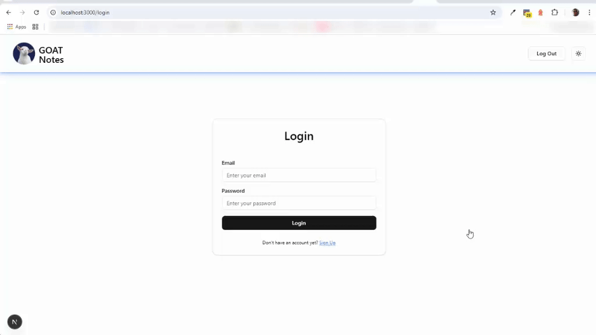


## 7. Create Supabase Project (0:32:12)

>[!TIP]  
> Debemos ingresar a la página de [supabase](https://supabase.com/dashboard), y crear una cuenta con  `github`:
>
>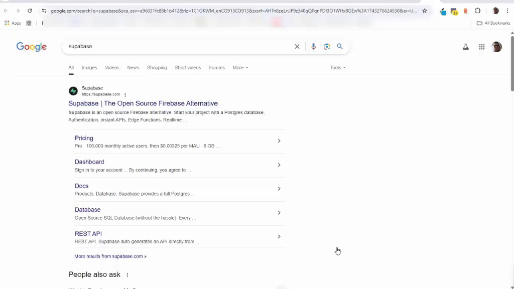

1. Entramos al sitio [supabase](https://supabase.com/dashboard).
2. Si nos falta o no tenemos la _Organization_ de nombre `Tutorials`, 
damos clic al botón `[New Organization]` y le ponemos de nombre
`Tutorials` y damos clic en el botón `[Create Organization]`:  
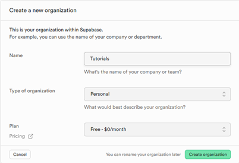
3. Regresamos al [supabase/dashboard](https://supabase.com/dashboard)
4. Damos clic al boton de `[New Project]` y dejamos la _Organization_ 
de nombre `Tutorials`.
5. Completamos el formulario:
    * Organization: `Tutorials`
    * Project-name: `giat-notes`
    * Database password: ~~xoxoxoxo~~ (Usamos una buena contraseña)
    * Region: `East US (North Virginia)`
* Así se ve el formulario:  
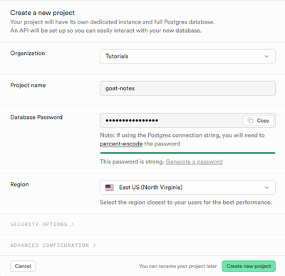
6. Y le damos clic en el botón `[Create new project]`:  
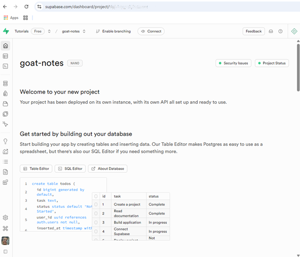

7. Regresamos a `Visual Studio Code` y creamos un archivo en la 
raíz del proyecto de nombre **`.env.local`** (ojo que empieza con un
punto `.`), con esta información:
```ini
DB_PASSWORD=xoxoxoxo
```
>[!CAUTION]  
>### Reemplazamos el `xoxoxoxo` del archivo **`env.local`**, por la contraseña que usamos cuando creamos el _Project_ en el paso 5.
8. Regresamos al sitio [projects](https://supabase.com/dashboard/projects) y seleccionamos el projecto
que estamos trabajando `goat-notes`.
9. Damos clic en el botón 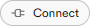 y nos vamos abajo al `Session pooler`, copiamos este texto que empieza con
`postgresql://postgres.` y termina con `@aws-0-us-east-1.pooler.supabase.com:5432/postgres` y lo pegamos en el nuevo
archivo **`.env.local`**, con el nombre de `DATABASE_URL`:
```ini
DATABASE_URL=postgresql://postgres...@aws-0-us-east-1.pooler.supabase.com:5432/postgres
```
10. Copiamos el valor de `DB_PASSWORD=` en el espacio de `[YOUR-PASSWORD]` y borramos la línea donde esta `DB_PASSWORD=`.
11. En el Sitio [goat-notes](https://supabase.com/dashboard), 
y cerramos la ventana de `Connect to your project` y abrimos el 
menú de la izquierda para buscar `Project Settings`:  
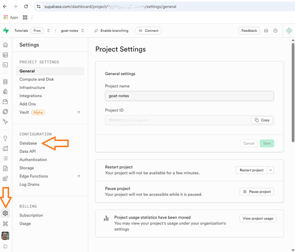
* Busco el de `Database`.
12. Damos clic en `API` o `Data API`:
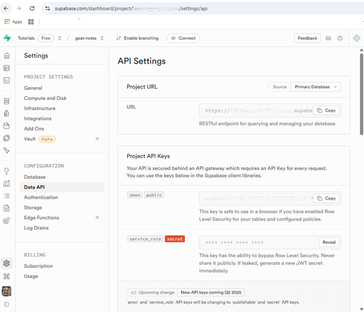
13. Copiamos el contenido de la `URL` y la pegamos en el archivo
**`.env.local`** con el nombre de `SUPABASE_URL`:
```ini
SUPABASE_URL=https://... .supabase.co
```
14. Copiamos `Project API Keys` el `anon` `public`, en la
variable: `SUPABASE_ANON_KEY`:
```ini
SUPABASE_ANON_KEY=X0X0X0X0X0
```
15. Creamos la variable `NEXT_PUBLIC_BASE_URL`, en el archivo **`.env.local`**:
```ini
NEXT_PUBLIC_BASE_URL=http://localhost:3000
```
16. Vamos dentro de `Settings` a `Authentication` y damos clic a 
`General user signup`:
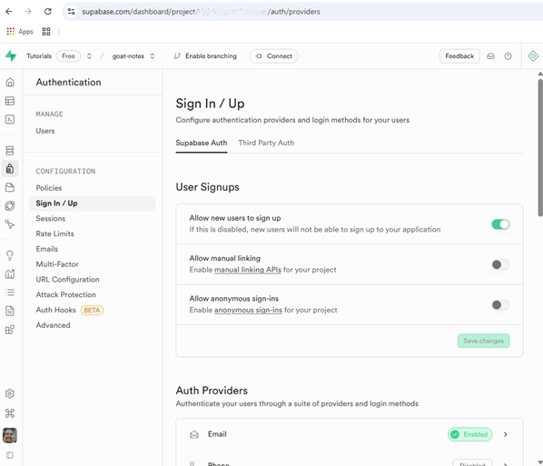
* Que Este activo `Allow new users to sign up`.
* Y `Email`.
17. Buscamos la guía para configurar `Supabase` para 
[`Server-Side Auth for Next.js`](https://supabase.com/docs/guides/auth/server-side/nextjs):  
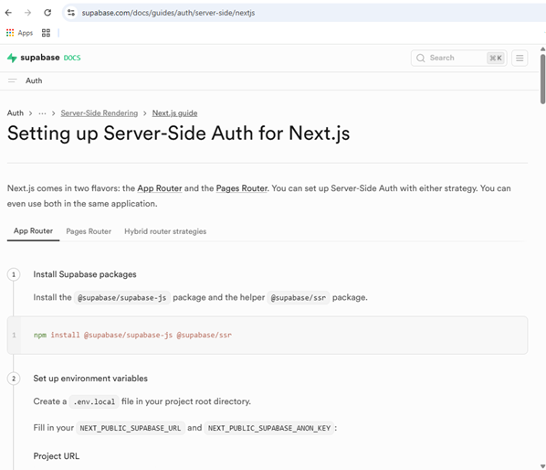
18. Copiamos, ajustamos y ejecutamos en una `TERMINAL` de `Visual Studio Code`:
```bash
pnpm install -E @supabase/supabase-js @supabase/ssr
```

## 8. Add Supabase Code (0:35:48)
1. Creamos un archivo **`auth/server.ts`**, en la carpeta
**"src"** y le pegamos el paso 3 del sitio 
[`Server-Side Auth for Next.js`](https://supabase.com/docs/guides/auth/server-side/nextjs).

2. Creamos en la carpeta **"src"**, el archivo de nombre
**`middleware.ts`** y le pegamos los dos del paso 4 del sitio 
[`Server-Side Auth for Next.js`](https://supabase.com/docs/guides/auth/server-side/nextjs).
3. En el archivo **'middleware.ts'**, ponemos los `import` arriba
y corregimos la ruta que está presentando fallas:
```js
import { NextResponse, type NextRequest } from "next/server";
//import { updateSession } from "@/utils/supabase/middleware";
import { createServerClient } from "@supabase/ssr";
```
4. Quitamos las `options` del primer 
`cookiesToSet.forEach(({ name, value, options }) =>`.
5. Corregimos en el archivo **'middleware.ts'** los valores de 
`process.env.`, por los que están en **`.env.local`**:
```js
  ...
  const supabase = createServerClient(
    process.env.SUPABASE_URL!,
    process.env.SUPABASE_ANON_KEY!,
    {...},
  );
```
6. Hacemos lo mismo en el archivo **`auth/server.ts`**:
```js
  ...
  return createServerClient(
    process.env.SUPABASE_URL!,
    process.env.SUPABASE_ANON_KEY!,
    {...},
  );
```
7. Comento debajo de `// IMPORTANT: DO NOT REMOVE auth.getUser()`
hasta nates de `// IMPORTANT: You *must* return the`, en el archivo **'middleware.ts'**
8. Comentamos también todo lo relacionado con
`const supabase = createServerClient(`. y lo sustituimos por
un `console.log`:
```js
  console.log("middleware ran");
```
9. Para probar el texto, intercambiamos con el link de `login` a
`Sign Up` y vemos el resultado en la `TERMINAL` de 
`Visual Studio Code`.
10. Regresamos al archivo **`auth/server.ts`** y hacemos estos cambios:
```js
...
export async function createClient() {
  ...
  const client = createServerClient(
    ...
  );

  return client;
}
```
11. Creamos una función de nombre `getUser()`, para ser exportada:
```js
export async function getUser() {
  const { auth } = await createClient();

  const userObject = await auth.getUser();

  if (userObject.error) {
    console.error(userObject.error);
    return null;
  }

  return userObject.data.user;
}
```

## 9. Add Auth Code Logic (0:40:52)

1. En el componente **`AuthForm.tsx`**, en la función 
`handleSubmit()`, cambiamos el `console.log()`, por este código:
```js
  function handleSubmit(formData: FormData) {
    startTransition(async() => {});
  }
```
2. Dentro de la función `handleSubmit(` completamos el
`startTransition()` cpturando los datos de `formData` y creando
tres variables:
```js
      const email = formData.get("email") as string;
      const password = formData.get("password") as string;

      let errorMessage = null;
      let title = null;
      let description = null;
```
3. Creamos una condicional con dos elementos `Action` para crear mas tarde:
```js

      if (isLoginForm) {
        errorMessage = (await loginAction(email, password)).errorMessage;
        title = "Logged in";
        description = "You have been successfully logged in";
      } else {
        errorMessage = (await signUpAction(email, password)).errorMessage;
        title = "Signed up";
        description = "Check your email for a confirmation Link";
      }
```

>![!WARNING]  
>Los errores son:
>* Cannot find name loginAction .
>* Cannot find name signUpAction .

4. Agregamos otro condicional para mostrar mensajes tipo `toast`:
```js
      if (!errorMessage) {
        toast({
          title,
          description,
          variant: "success",
        });
        router.replace("/"); // En vez de redirigir a la pagina principal, redirigir a la pagina de confirmacion de correo
      } else {
        toast({
          title: "An error occurred",
          description: errorMessage,
          variant: "destructive",
        });
      }
```
5. Creamos un archivo en la carpeta **"src"** de nombre 
**`actions/users.ts`**, con este código:
```js
"use server";

import { createClient } from "@/auth/server";

export async function loginAction(email: string, password: string) {
  try {
    const { auth } = await createClient();
    const { error } = await auth.signInWithPassword({ email, password });
    if (error) throw error;

    return { errorMessage: null };
  } catch (error) {
    return handleError(error);
  }
}
```
6. Por el error de `handleError`, creamos en el archivo 
**`lib/utils.ts`**, cramos la función `handleError()` que sea
exportada:
```js
export function handleError(error: unknown) {
  if (error instanceof Error) {
    return { errorMessage: error.message };
  } else {
    return { errorMessage: "An error occurred" };
  }
}
```
7. Regresamos a **`actions/users.ts`** e importamos la 
función:
```js
import { handleError } from "@/lib/utils";
```
8. Clonamos en **`actions/users.ts`**, la función `loginAction()`
con el nombre de `signUpAction()`, con estos ajustes:
```js
export async function signUpAction(email: string, password: string) {
  try {
    const { auth } = await createClient();
    const { data, error } = await auth.signUp({ email, password });
    if (error) throw error;

    const userId =data.user?.id;
    // Acá estamos usando los usuarios de Supabase
    if (!userId) throw new Error("Error signing up");  

    // Add user to database

    return { errorMessage: null };
  } catch (error) {
    return handleError(error);
  }
```
9. Regresamos al componente **`AuthForm.tsx`** y ponemos las 
importaciones faltantes:
```js
import { loginAction, signUpAction } from "@/actions/users";
```
10. Antes de Probar, debemos ir al arhivo **`Header.tsx`** y poner la 
función `Header()`de forma `async` y cambiar el valor de `user`:
```js
...
import { getUser } from "@/auth/server";

async function Header() {
  const user = await getUser();

  return (
    ...
  );
}
```
>[!WARNING]  
>Lo anterior arrojará un error en la `TERMINAL`:
>```bash
>Error [AuthSessionMissingError]: Auth session missing!
>    at <unknown> (../../src/GoTrueClient.ts:1210:48)
>    at SupabaseAuthClient._useSession (../../src/GoTrueClient.ts:1065:19)
>    at async SupabaseAuthClient._getUser (../../src/GoTrueClient.ts:1202:13)
>    at async (../../src/GoTrueClient.ts:1186:13)
>    at async (../../src/GoTrueClient.ts:973:17) {
>  __isAuthError: true,
>  status: 400,
>  code: undefined
>}
>```

>[!NOTE]  
>Este es un ejemplo de ejecución ya permitiendo crear un usuario 
>para luego usarlo en el proceso de _login_:  
>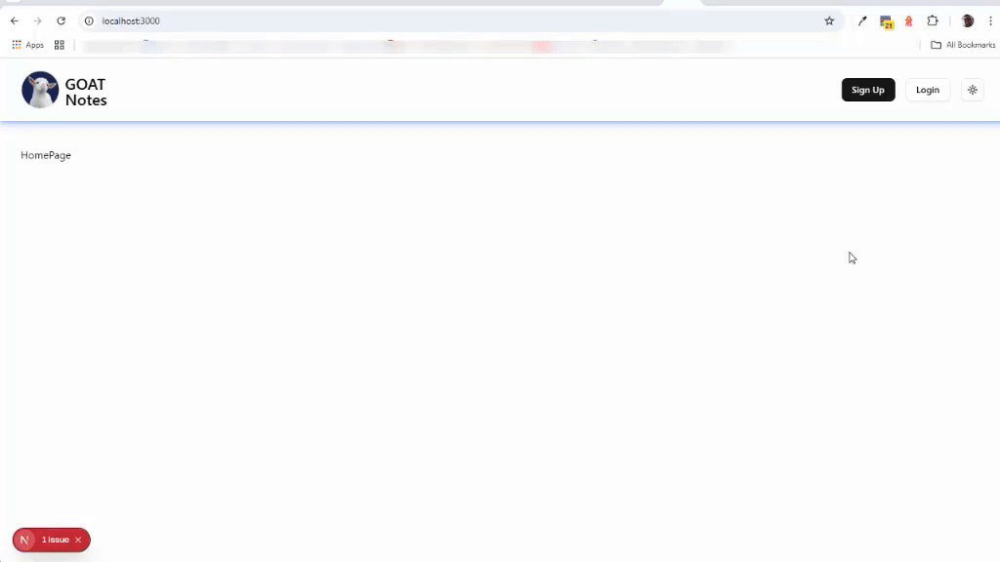

11. Regresamos al archivo **`actions/users.ts`**, creamos una nueva
función de nombre `logOutAction()`:
```js
export async function logOutAction() {
  try {
    const { auth } = await createClient();
    const { error } = await auth.signOut();
    if (error) throw error;

    return { errorMessage: null };
  } catch (error) {
    return handleError(error);
  }
}
```
12. Buscamos el componente **`LogOutButton.tsx`**, borramos esto:  
`await new Promise((resolve) => setTimeout(resolve, 1000));`.
13. Cambiamos esto: `const errorMesage = null;` por esto:
```js
    const { errorMessage } = await logOutAction();
```
* Se corrige el uso del nombre correcto de la constante
`errorMessage`.

14. Se presiona el botón `[Log Out]`, se cierra la sesión del usuario
y muestra abajo este mensaje:  
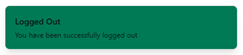


## 10. Add Prisma Code (0:50:02)

1. Empezamos en este sition [`What is Prisma ORM?`](https://www.prisma.io/docs/orm/overview/introduction/what-is-prisma),
y bajamos a la parte de [`How does Prisma ORM work?`](https://www.prisma.io/docs/orm/overview/introduction/what-is-prisma#how-does-prisma-orm-work), le damos copiar al texto que
corresponde a `Relational databases`.
2. Creamos en la carpeta **"src"** un archivo de nombre 
**`db/schema.prisma`** y pegamos lo que copiamos antes.
3. Verificamos que las variables en el **`db/schema.prisma`**,
sean las mismas del archivo **`.env.local`**.
4. Hacemos unos cambios en el archivo **`db/schema.prisma`**:
```ini
datasource db {
  provider = "postgresql"
  url      = env("DATABASE_URL")
}

generator client {
  provider = "prisma-client-js"
}

model Note {
  id        String    @id @default(uuid())
  text      String
  author    User?     @relation(fields: [authorId], references: [id])
  authorId  String?
  creationAt DateTime @default(now())
  updateAt  DateTime  @updatedAt   @default(now())
}

model User {
  id        String    @id @default(uuid())
  email     String    @unique
  posts     Note[]
  creationAt DateTime @default(now())
  updateAt  DateTime  @updatedAt   @default(now())
}
```
>[!CAUTION]
>### Mucho cuidado al usar el nombre del campo `updateAt` y la función `@updatedAt`, es con la `d`, en pasado.
5. Creamos en la carpeta **"src/db"** el archivo **`db/prisma.ts`**
y le copiamos los dato de este sitio [Best practices for using Prisma Client in development](https://www.prisma.io/docs/orm/more/help-and-troubleshooting/nextjs-help#best-practices-for-using-prisma-client-in-development).

>[!WARNING]  
>Nos sale este error en el archivo **`db/prisma.ts`**:
>```diff
>-Cannot find module '@prisma/client' or its corresponding type declarations.. 
>```

6. Vamos a la `TERMINAL` y ejecutamos este comando:
```bash
pnpm add @prisma/client -E
pnpm install prisma --save-dev -E
```
8. Abrimos el archivo **`package.json`** y añadimos una línea en la
zona de `"scripts":`:
```json
{
  "name": "goat-notes",
  "version": "0.1.0",
  "private": true,
  "scripts": {
    ...
    "migrate": "pnpm dlx prisma generate && env $(cat .env.local | xargs) pnpm dlx prisma migrate dev"
  },
  "prisma": {
    "schema": "src/db/schema.prisma"
  },
  "dependencies": {
    ...
  },
  "devDependencies": {
    ...
  }
}
```
9. En el archivo **`db/prisma.ts`**, sigue el error, entonces en la
`TERMINAL` ejecutamos este comando:
```bash
pnpm migrate
```

>[!CAUTION]  
>### Error ejecutando el comando de `pnpm migrate`
>```Diff
>-npm error could not determine executable to run
>-npm error A complete log of this run can be found in: ...    
>-ELIFECYCLE  Command failed with exit code 1.
>```
>En este sitio hallé mucha de la solución a este error:  
>[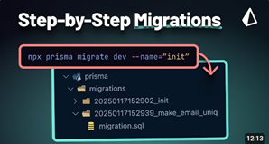](https://www.youtube.com/watch?v=ZaCFsFES5yQ)
>
>En Windows se requieren hacer mas pasos:
>1. Instalar la librería `dotenv-cli`:
>```bash
>pnpm add dotenv-cli -D -E
>```
>2. Se ajustó el `"scripts":` de **`package.json`**, para quedar
>así:
>```json
>{
>  ...
>  "scripts": {
>    ...
>    "prisma:generate": "prisma generate --schema=./src/db/schema.prisma",
>    "prisma:migrate": "dotenv -e ./.env.local prisma migrate dev",
>    "migratebash": "pnpm dlx prisma generate && env $(cat .env.local | xargs) pnpm dlx prisma migrate dev"
>  },
>  "prisma": {
>    "schema": "src/db/schema.prisma"
>  },
>  ...
>}
>```
>3. Se ejectutan por aparte dos comandos en la `TERMINAL`,
>el primero:
>```bash
>pnpm prisma:generate
>```
>4. Crea un valor mas en el **`package.json`** de nombre 
>`"goat-notes"`:  
>```json
>  "dependencies": {
>    ...
>    "goat-notes": "file:",
>    ...
>  },
>```
>5. Y esta info en la `TERMINAL`:
>```bash
>Prisma schema loaded from src\db\schema.prisma
>
>✔ Generated Prisma Client (v6.5.0) to .\node_modules\.pnpm\@prisma+client@6.5.0_prisma_fccffc52d17c43e****\node_modules\@prisma\client in 103ms
>
>Start by importing your Prisma Client (See: https://pris.ly/d/importing-client)
>```
>6. Siguiente comando en la `TERMINAL`
>```bash
>pnpm prisma:migrate
>```
>7. Esto aparece en la `TERMINAL`, pide un dato y simplemente le
>escribimos `init`
>```bash
>Prisma schema loaded from src\db\schema.prisma
>Datasource "db": PostgreSQL database "postgres", schema "public" at "aws-0-us-east-1.pooler.supabase.com:5432"
>
>? Enter a name for the new migration: »
>```
>8. Esto aparece en la `TERMINAL`, luego de digitar `init`:
>```dos
>Applying migration `20250402201517_init`
>
>The following migration(s) have been created and applied from new schema changes:
>
>migrations/
>  └─ 20250402201517_init/
>    └─ migration.sql
>
>Your database is now in sync with your schema.
>
>✔ Generated Prisma Client (v6.5.0) to .\node_modules\.pnpm\@prisma+client@6.5.0_prisma_fccffc52d17c43efe****\node_modules\@prisma\client in 116ms
>```
>9. En la carpeta **"src/db"**, tenemos una nueva carpeta de nombre
>**"migrations"** y dentro otras carpetas y archivos, se sugiere 
>no editar ni modificar.
>10. Vamos al sitio de nuestra base de datos en 
>[Supabase/Projects](https://supabase.com/dashboard/projects) y
>vemos que nos parecen tablas nuevas:  
>
>

10. En el archivo **`actions/users.ts`** añadimos a la función
`signUpAction()`, antes del `return` y debajo de 
`// Add user to database` lo siguiente:
```js
    await prisma.user.create({ data: { id: userId, email } });
```
* Así sería la prueba a realizar y verificación en la tabla `user`:  
")


## 11. Build Sidebar (0:58:35)

1. Empezamos teniendo como punto de referencia este sitio
[Sidebar](https://ui.shadcn.com/docs/components/sidebar), y vamos para el punto `2 Add the following colors to your CSS file` y 
lo comparamos con el archivo **`global.css`** y vemos que ya
tiene lo datos cargados previamente.
2. En una `TERMINAL`, del sitio [Sidebar](https://ui.shadcn.com/docs/components/sidebar) 
ejecutamos el comando:
```bash
pnpm dlx shadcn@latest add sidebar -E
```
3. De mismo sitio abajo en `Usage`, detallamos su forma de uso,
y abrimos el archivo **`layout.tsx`** y envolvemos todo el 
elemento `<div`, con `<SidebarProvider>`:
```js
          <SidebarProvider>
            <div className="flex min-h-screen w-full flex-col">
              <Header />
              <main className="flex flex-1 flex-col px-4 pt-10 xl:px-8">
                {children}
              </main>
            </div>
          </SidebarProvider>
```
* Importar el datos realcionado `import { SidebarProvider } from "@/components/ui/sidebar";`
4. Debajo de la apertura de `<SidebarProvider>`, ponemos este
componente: `<AppSidebar />`.
>[!WARNING]  
>Nos aparece este error:
>```diff
>-Cannot find name 'AppSidebar'.
>```
5. Creamos en la carpeta **"src/components"** el archivo de nombre
**`AppSidebar.tsx`** y del sitio [Sidebar](https://ui.shadcn.com/docs/components/sidebar)
en la parte `components/app-sidebar.tsx` copiamos y pegamos en
el nuevo archivo:
```js
import {
  Sidebar,
  SidebarContent,
  SidebarFooter,
  SidebarGroup,
  SidebarHeader,
} from "@/components/ui/sidebar"

export function AppSidebar() {
  return (
    <Sidebar>
      <SidebarHeader />
      <SidebarContent>
        <SidebarGroup />
        <SidebarGroup />
      </SidebarContent>
      <SidebarFooter />
    </Sidebar>
  )
}
```
6. Regresamos al archivo **`layout.tsx`** y ponemos la importación
del nuevo componente:
```js
import { AppSidebar } from "@/components/AppSidebar";
```
* Así nos aparece el browser hasta el momento:  
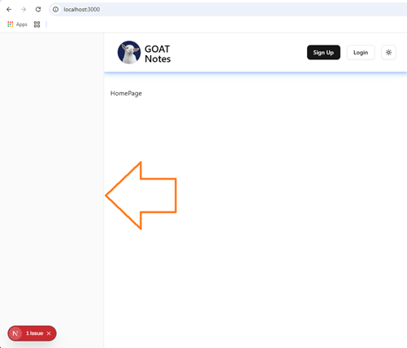

7. Hacemos algunos ajustes al componente **`AppSidebar.tsx`**:
```js
import {
  Sidebar,
  SidebarContent,
  SidebarFooter,
  SidebarGroup,
  SidebarHeader,
} from "@/components/ui/sidebar";

async  function AppSidebar() {
  return (
    <Sidebar>
      <SidebarHeader />
      <SidebarContent>
        <SidebarGroup />
        <SidebarGroup />
      </SidebarContent>
      <SidebarFooter />
    </Sidebar>
  );
}

export default AppSidebar;
```
8. Debemos borrar la importación `import { AppSidebar } from "@/components/AppSidebar";` y volver a importar:
```js
import AppSidebar from "@/components/AppSidebar";
```
9. Empezamos añadiendo a la función `AppSidebar()`, algunos 
cambios, antes del `return`, con las respectivas importaciones:
```js
import { getUser } from "@/auth/server";
...
import { prisma } from "@/db/prisma";
import { Note } from "@prisma/client";

async  function AppSidebar() {
  const user = await getUser(); // "@/auth/server"

  let notes : Note[] = []; // "@prisma/client"

  if (user){ // Conditicional para verificar si el usuario existe
    // Query para traer las notas del usuario
    notes = await prisma.note.findMany({ // "@/db/prisma", 
      where: {
        authorId: user.id,
      },
      orderBy: {
        updateAt: "desc",
      },
    });
  }

  return (...);
}
...
```
10. Borramos del componente **`AppSidebar.tsx`**, la línea de
`<SidebarHeader />` y la respectiva importación.
11. Agregamos un `className` al renderizado o llamado del componente
`<SidebarContent`:
```js
      <SidebarContent className="custom-scrollbar">
```
12. Ajustamos el renderizado o llamado de `<SidebarGroup` para dejar
uno solo, llamando otro componente `<SidebarGroupLabel` y la 
respectiva importación:
```js
        <SidebarGroup>
          <SidebarGroupLabel></SidebarGroupLabel>
        </SidebarGroup>
```
13. Ponemos un condicional ternario dentro del renderizado de 
`<SidebarGroupLabel`:
```js
          <SidebarGroupLabel>
            {user ? (
              "Your Notes"
            ) : (
              <p>
                <Link href="/login" className="underline">
                  Login
                </Link>{" "}
                to see your notes
              </p>
            )}
          </SidebarGroupLabel>
```
* El `<Link` lo importamos de `"next/link"`.
14. Al renderizado de `<SidebarGroupLabel`, le agregamos un 
`className`:
```js
          <SidebarGroupLabel className="mt-2 mb-2 text-lg">
```
15. Debajo del cierre de `</SidebarGroupLabel>`, ponemos esto:
```js
        <SidebarGroup>
          <SidebarGroupLabel {...}>
           ...
          </SidebarGroupLabel>
          {user && <SidebarGroupContent notes={notes} />}
        </SidebarGroup>
```
>[!WARNING]  
>En la línea de `{user && <SidebarGroupContent notes={notes} />}`
>nos sale un error relacionado con `notes`
>```diff
>-Type '{ notes: { id: string; text: string; authorId: string | null; creationAt: Date; updateAt: Date; }[]; }' is not assignable to type 'IntrinsicAttributes & ClassAttributes<HTMLDivElement> & HTMLAttributes<HTMLDivElement>'.
  Property 'notes' does not exist on type 'IntrinsicAttributes & ClassAttributes<HTMLDivElement> & HTMLAttributes<HTMLDivElement>'
>``` 
16. Borramos la importación de `SidebarGroupContent`.
17. Creamos en la carpeta **"src/components"** el archivo de nombre
**`SidebarGroupContent.tsx`**, con el _snippet_ de `rfce`:
```js
import React from "react";

function SidebarGroupContent() {
  return <div>SidebarGroupContent</div>;
}

export default SidebarGroupContent;
```
18. Cambiamos la `import React from "react";` por 
`"use client";`.
19. Añadimos un `Type Props` y la importación `"@prisma/client"`:
```js
"use client";

import { Note } from "@prisma/client";

type Props = {
  notes: Note[]; // "@prisma/client"
};

function SidebarGroupContent(notes: Props) {
  return <div>SidebarGroupContent</div>;
}

export default SidebarGroupContent;
```
20. Regresamos al componente **`AppSidebar.tsx`** y corregimos la 
importación faltante de `<SidebarGroupContent`.
```js
import SidebarGroupContent from "./SidebarGroupContent";
```
21. Regresamos al nuevo componente **`SidebarGroupContent.tsx`**,
para efectuar estos cambios:
```js
"use client";

import { Note } from "@prisma/client";

type Props = {
  notes: Note[]; // "@prisma/client"
};

function SidebarGroupContent(notes: Props) {
  console.log(notes);
  return <div>Your notes here</div>;
}

export default SidebarGroupContent;
```

>[!TIP]  
>### Abrir el archivo **`package.json`** y borra todos los _carets_ (`^`).

## 12. Build Home Page (1:04:25)

1. En el archivo **`app/page.tsx`**, agregamos un
`className`:
```js
    <div className="flex h-full flex-col items-center gap-4">
```
2. El texto de `HomePage` lo cambiamos por un `<div` mas un
`className`:
```js
function HomePage() {
  return (
    <div className="flex h-full flex-col items-center gap-4">
      <div className="flex w-full max-w-4xl justify-end gap-2"></div>
    </div>
  );
}
```
3. Renderizo dos componentes dentro del `<div` interno, y otro 
componente antes de cerrar el `<div` externo:
```js
  return (
    <div className="flex h-full flex-col items-center gap-4">
      <div className="flex w-full max-w-4xl justify-end gap-2">
        <AskAIButton user={user} />
        <NewNoteButton user={user} />
      </div>

      <NoteTextInput noteId={noteId} startingNoteText={note?.text || ""} />
    </div>
  );
```

>[!WARNING]  
>No salen errores por que no existen los componentes:
>* `<AskAIButton `
>* `<NewNoteButton`
>* `<NoteTextInput`

4. La función `function HomePage()`, la hacemos `async` y en una
constante capturamos el `getUser()`:
```js
async function HomePage() {
  const user = await getUser(); // "@/auth/server"
  ...
  );
}
```
5. Creamos otra constante de nombre `noteIdParam`:
```js
  const noteIdParam = (await searchParams).noteId;
```
6. A la función le agregamos un `{searchParams}` de tipo `Props`,
que a su vez lo definimos antes:
```js
...
type Props = {
  searchParams: any;
};

async function HomePage({ searchParams }: Props) {
  ...
}
...
```
7. Definimos mejor el contenido del tipo para `searchParams`:
```js
type Props = {
  searchParams: Promise<{ [key: string]: string | string[] | undefined }>;
};
```
8. Definimos dentro de la función la constante `noteId`,
con un ternario:
```js
  const noteId = Array.isArray(noteIdParam)
    ? noteIdParam![0]
    : noteIdParam || "";
```
9. Definimos la constante `note`, importamos a `prisma` de
`"@/db/prisma"`, para hacer un query para obtener las `note`:
```js
  const note = await prisma.note.findUnique({ // "@/db/prisma"
    where: { id: noteId, authorId: user?.id },
  });
```
10. Creamos en la ruta **"src/components"** uno de los componentes
faltantes de nombre **`AskAIButton.tsx`**, y lo completamos
con el _snippet_ de `rfce`:
```js
import React from "react";

function AskAIButton() {
  return <div>AskAIButton</div>;
}

export default AskAIButton;
```
11. Cambiamos `import React from "react";` por `"use client";`.
12. Definimos un `type Props` y lo ponemos como parámetro a la 
función:
```js
...
import { User } from "@supabase/supabase-js";

type Props = { user: User | null} ; // "@supabase/supabase-js"

function AskAIButton({user}: Props) {
  console.log("AskAIButton", user.email);
  return <div>AskAIButton</div>;
}
```
13. En el componente **`app/page.tsx`**, importamos el nuevo componente.
14. Para no dejar el componente  **`app/page.tsx`**, con tantos 
errores, creamos en la misma carpeta **"src/components"**, 
dos componentes con datos muy básicos,
con los nombres **`NewNoteButton.tsx`** y **`NoteTextInput.tsx`**:
* **`NewNoteButton.tsx`**:
```js
"use client";

import { User } from "@supabase/supabase-js";

type Props = { user: User | null} ; // "@supabase/supabase-js"

function NewNoteButton({user}: Props) {
  console.log("NewNoteButton", user?.email);
  return <div>NewNoteButton</div>;
}

export default NewNoteButton;
```
* **`NoteTextInput.tsx`**:
```js
"use client";

type Props = {
  noteId: string;
  startingNoteText: string;
};

function NoteTextInput({ noteId, startingNoteText }: Props) {
  console.log("NoteTextInput", noteId, startingNoteText);
  return <div>NoteTextInput</div>;
}

export default NoteTextInput;
```
15. Completamos la importación de todos los elementos en el 
componente **`app/page.tsx`*:
```js
import AskAIButton from "@/components/AskAIButton";
import NewNoteButton from "@/components/NewNoteButton";
import NoteTextInput from "@/components/NoteTextInput";
```

## 13. Set Up OpenAI Account (1:09:11)

1. Empezamos ingresando a este sitio [OpenIA - API Platform](https://openai.com/api/).
2. En la esquina superior derecha escogemos del `[Log in]`
la opción de `API Platform`.
3. No abre una ventana para completar el [Log in](https://auth.openai.com/log-in), se sugiere utilizar
el de `Google`:  
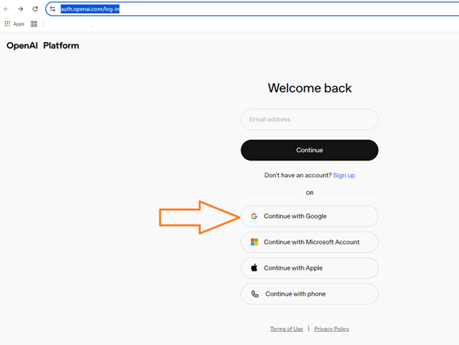


4. Nos lleva a la página de `OpenAI developer platform`:  
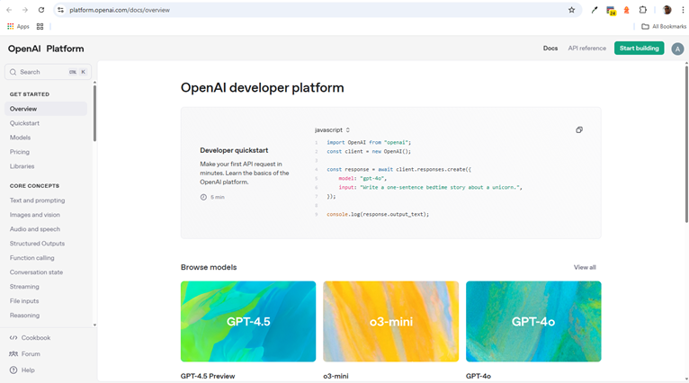


5. En esta versión le damos en el botón `[Start building]` y nos pide 
lo siguiente:  
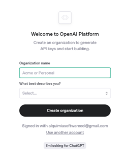
* Ponemos cuqlquier nombre o simplemente `Personal` y en la segunda 
casilla la de `Very Technical` y clic en el botón 
`[Create Organization]`


6. En la parte de correos, poner otros que les interese tu 
definición o simplemente dejar en blanco.


7. Nos pide `Make your first API call` para generar el `API Key`:  
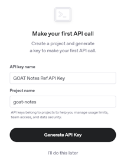
* Usamos el nombres de:
    * `Api key name`: `GOAT Notes Ref API Key`.
    * `Project name`: `goat-notes`
  

8. Luego de darle clic en el botón `[Generate API Key]`, nos pide hacer una prueba, con el valor de dicha API:  
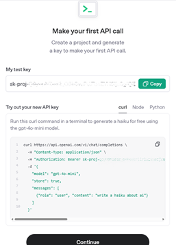


9. Al final te sugiere comprar créditos, yo simplemente le di 
`I'll buy credits later`:  
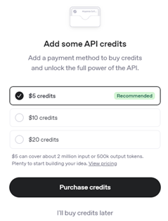


10. Estando en el proyecto `goat-notes`, ingresamos al ícono del piñón o engranaje
<svg xmlns="http://www.w3.org/2000/svg" width="16" height="16" fill="currentColor" class="bi bi-gear" viewBox="0 0 16 16">
  <path d="M8 4.754a3.246 3.246 0 1 0 0 6.492 3.246 3.246 0 0 0 0-6.492M5.754 8a2.246 2.246 0 1 1 4.492 0 2.246 2.246 0 0 1-4.492 0"/>
  <path d="M9.796 1.343c-.527-1.79-3.065-1.79-3.592 0l-.094.319a.873.873 0 0 1-1.255.52l-.292-.16c-1.64-.892-3.433.902-2.54 2.541l.159.292a.873.873 0 0 1-.52 1.255l-.319.094c-1.79.527-1.79 3.065 0 3.592l.319.094a.873.873 0 0 1 .52 1.255l-.16.292c-.892 1.64.901 3.434 2.541 2.54l.292-.159a.873.873 0 0 1 1.255.52l.094.319c.527 1.79 3.065 1.79 3.592 0l.094-.319a.873.873 0 0 1 1.255-.52l.292.16c1.64.893 3.434-.902 2.54-2.541l-.159-.292a.873.873 0 0 1 .52-1.255l.319-.094c1.79-.527 1.79-3.065 0-3.592l-.319-.094a.873.873 0 0 1-.52-1.255l.16-.292c.893-1.64-.902-3.433-2.541-2.54l-.292.159a.873.873 0 0 1-1.255-.52zm-2.633.283c.246-.835 1.428-.835 1.674 0l.094.319a1.873 1.873 0 0 0 2.693 1.115l.291-.16c.764-.415 1.6.42 1.184 1.185l-.159.292a1.873 1.873 0 0 0 1.116 2.692l.318.094c.835.246.835 1.428 0 1.674l-.319.094a1.873 1.873 0 0 0-1.115 2.693l.16.291c.415.764-.42 1.6-1.185 1.184l-.291-.159a1.873 1.873 0 0 0-2.693 1.116l-.094.318c-.246.835-1.428.835-1.674 0l-.094-.319a1.873 1.873 0 0 0-2.692-1.115l-.292.16c-.764.415-1.6-.42-1.184-1.185l.159-.291A1.873 1.873 0 0 0 1.945 8.93l-.319-.094c-.835-.246-.835-1.428 0-1.674l.319-.094A1.873 1.873 0 0 0 3.06 4.377l-.16-.292c-.415-.764.42-1.6 1.185-1.184l.292.159a1.873 1.873 0 0 0 2.692-1.115z"/>
</svg>, 
que es el `Settings`, en la parte superior derecha:
  
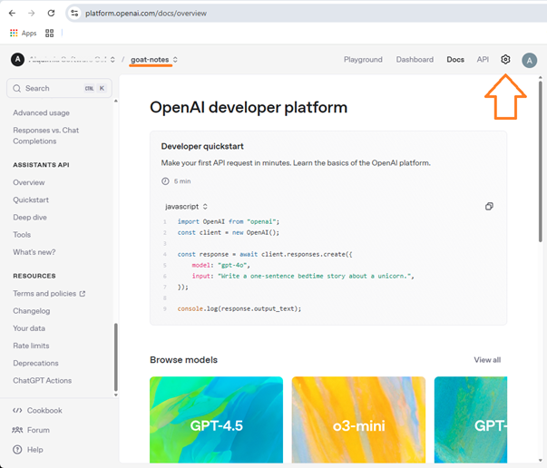


11. La API Key del paso 8 de , la copiamos en el archivo **`.env.local`**
con el nombre de `OPENAI_API_KEY`.
12. Regresamos al componente **`app/page.tsx`**, dentro de la función
`HomePage()` y damos `[Ctrl]` + click en el renderizado de 
`<AskAIButton`.


## 14. Build NoteTextInput (1:11:22) 

>[!NOTE]  
>Acá apenas el instructor está completando y creando los tres 
>componentes del paso anterior [Build Home Page](#12-build-home-page-10425):
>* **`AskAIButton.tsx`**
>* **`NewNoteButton.tsx`**
>* **`NoteTextInput.tsx`**
>
>Ya veremos que nos quedó faltando en cada componente.  
>Y veo que se atinamos a todo lo mínimo para que el aplicativo
>funcione sin errores, y esta es la pantalla hasta ahora:  
>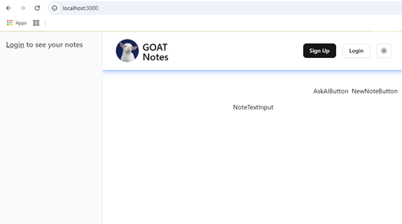


1. Vamos a completar el componente **`NoteTextInput.tsx`**, con
lo siquiente, antes del `return`:
```js
  const noteIdParam = useSearchParams().get("noteIp") || "";
  const { noteText, setNoteText } = useNote();
```
>[!WARNING]  
>Obtenemos estos errores:
>* Duplicate identifier 'noteId'.
>* Cannot find name 'useNote'.
>
>Pero seguimos:
2. Creo una función de nombre `handleUpdateNote()`, por ahora vacía:
3. En una `TERMINAL` ejecutamos el comando de este sitio  
[Texarea](https://ui.shadcn.com/docs/components/textarea):
```bash
pnpm dlx shadcn@latest add textarea
```
4. Cambiamos los elementos `<div` por `<Textarea`, con la respectiva
impotación de `import { Textarea } from "./ui/textarea";`.
5. Cambiamoe el `Textarea`, por un auto cerrable y otros cambios:
```js
  return <Textarea
    value={noteText}
    onChange={handleUpdateNote}
    placeholder="Write your note here..."
    className="custom-scrollbar mb-4 h-full max-w-4xl resize-none border p-4 placeholder:text-muted-foreground focus-visible:ring-0 focus-visible:ring-offset-0"
  />;
```
6. Complementamos la función `handleUpdateNote()`:
```js
  function handleUpdateNote(e: ChangeEvent<HTMLTextAreaElement>) {
    const updatedNoteText = e.target.value;
    setNoteText(updatedNoteText);
  }
```
7. Creamos una variable por fuera de la función de nombre 
`updateTimeout` y de tipo `NodeJS.Timeout`.
>[!NOTE]  
>La razón de utilizar esto es, cuando estás digitando no debe 
>guardarse en cada vez que se teclea, y será guardado cuando 
>haya pasado uno o dos segundos, se llama _atiborrar_.
8. Hacemos uso de este `Timeout`, en la función ``:
```js
    clearTimeout(updateTimeout);
    updateTimeout = setTimeout(() => {
      updateNoteAction(noteId, updatedNoteText);
    }, debounceTimeout);
```
9. En la carpeta **"src/lib"** creamos el archivo **`constants.ts`**:
```js
export const debounceTimeout = 1500;
```
10. Lo importamos en el componente **`NoteTextInput.tsx`**.
11. Creamos un _hook_ de tipo `useEffect`:
```js
  useEffect(() => {
    if (noteIdParam === noteId) {
      setNoteText(startingNoteText);
    }
  }, [startingNoteText, noteIdParam, noteId, setNoteText]);
```
12. Temporal, para subir al repositorio sin errores
```js
/*🗑️  ->🗑️<-  ->🗑️<-  ->🗑️<-  ->🗑️<- ->🗑️<-  ->🗑️<-  ->🗑️<-  ->🗑️*/
/*🗑️*/function useNote() {
/*🗑️*/  return {
/*🗑️*/    noteText: "",
/*🗑️*/    setNoteText: (text: string) => {},
/*🗑️*/  };
/*🗑️*/}
/*🗑️*/function updateNoteAction(noteId: string, noteText: string) {
/*🗑️*/  console.log("Updating note ", noteId, noteText);
/*🗑️*/}
/*🗑️  ->🗑️<-  ->🗑️<-  ->🗑️<-  ->🗑️<- ->🗑️<-  ->🗑️<-  ->🗑️<-  ->🗑️*/
```

>[!TIP]  
>### Abrir el archivo **`package.json`** y borra todos los _carets_ (`^`).


## 15. Create Context and Custom Hook (1:18:18)

1. En la carpeta **"src/providers"**, creamos el archivo de nombre
**`NoteProvider.tsx`**, con esto:
```js
"use client";

import { createContext, useState } from "react";

type NoteProviderContextType = {
  noteText: string;
  setNoteText: (noteText: string) => void;
};

export const NoteProviderContext = createContext<NoteProviderContextType>({
  noteText: "",
  setNoteText: () => {},
});

function NoteProvider({ children }: { children: React.ReactNode }) {
  const [noteText, setNoteText] = useState("");

  return (
    <NoteProviderContext.Provider value={{ noteText, setNoteText }}>
      {children}
    </NoteProviderContext.Provider>
  );
}useNotes.tsx

export default NoteProvider;
```
2. Creamos un _Custom Hook_ en la carpeta **"src/hooks"** de nombre
**`useNote.tsx`**, con este código:
```js
"use client";

import { NoteProviderContext } from "@/providers/NoteProvider";
import { useContext } from "react";

function useNote() {
  const context = useContext(NoteProviderContext);

  if (!context) throw new Error("useNote must be used within a NoteProvider");

  return context;
}

export default useNote;
```
3. Volvemos al componente **`NoteTextInput.tsx`**, borramos
del texto temporal la función `useNote()` 
e importamos lo que recién se implementó:
```js
import useNote from "@/hooks/useNote";
```
* Así luce hasta el momento en pantalla:  
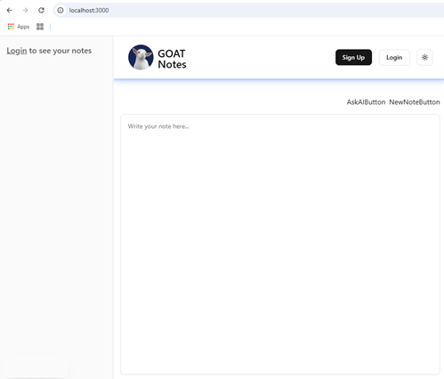


4. Regresamos al archivo **`app/layout.tsx`** y encerramos desde
`<SidebarProvider>` hasta `<Toaster />`, dentro del nuevo 
_provider_ de nombre `NoteProvider`:
```js
          <NoteProvider>
            <SidebarProvider>
              <AppSidebar />
              <div className="flex min-h-screen w-full flex-col">
                <Header />
                <main className="flex flex-1 flex-col px-4 pt-10 xl:px-8">
                  {children}
                </main>
              </div>
            </SidebarProvider>
            <Toaster />
          </NoteProvider>
```
* Recordar la respectiva importación:  
`import NoteProvider from "@/providers/NoteProvider"`


## 16. Write Update Note Server Action (1:22:06)

1. Creamos en la carpeta **"src/actions"** un archivo de nombre
**`notes.ts`**, con este código:
```js
"use server";
```
2. Del archivo **`actions/users.ts`**, copiamos la primera función
de nombre `loginAction()`, en el archivo **`actions/notes.ts`**, le hacemos unos cambios e importamos lo necesario:
```js
import { handleError } from "@/lib/utils";

export async function updateNoteAction(noteId: string, text: string) {
  try {

    return { errorMessage: null };
  } catch (error) {
    return handleError(error);
  }
}
```
3. En el `try`, antes del `return`, empezamos a poner código, y a
completar las importaciones necesarias:
```js
"use server";

import { getUser } from "@/auth/server";
import { prisma } from "@/db/prisma";
import { handleError } from "@/lib/utils";

export async function updateNoteAction(noteId: string, text: string) {
  try {
    const user = await getUser();
    if (!user) throw new Error("You must be logged in to update a note");

    await prisma.note.update({
      where: { id: noteId },
      data: { text },
    });

    return { errorMessage: null };
  } catch (error) {
    return handleError(error);
  }
}
```
4. Regresamos al componente **`NoteTextInput.tsx`**, borramos
la función temporal de nombre `updateNoteAction` e importamos
la nueva de `actions`: 
```js
import { updateNoteAction } from "@/actions/notes";
```

## 17. Finish NewNoteButton (1:24:27)

1. Vamos al componente **`NewNoteButton.tsx`**, empezamos cambiando
el elemento `<div` , por un `<Button`, con la respectiva importación
`import { Button } from "./ui/button";`.
2. Borramos el `console.log`
3. Coloquemos código dentro del renderizado del `<Button`:
```js
function NewNoteButton({ user }: Props) {
  const loading = false; // Simulate loading state

  return (
    <Button>
      {loading ? <Loader2 className="animate-spin" /> : "New Note"}
    </Button>
  );
}
```
4. Al renderizado de `<Button` le añadimos una acciónde `onClick`:
```js
  return (
    <Button
      onClick={handleClickNewNoteButton}
      variant="secondary"
      className="w-24"
      disabled={loading}
    >
      {loading ? <Loader2 className="animate-spin" /> : "New Note"}
    </Button>
  );
```
5. Pongamos a `loading` como un _hook_ de tipo `useState`:
```js
  const [loading, setLoading] = useState(false);
```
6. Creamos la función faltante `handleClickNewNoteButton()`:
```js
  async function handleClickNewNoteButton() {}
```
7. Creamos la constante `router` que es un _hook_ de tipo
`useRouter`:
```js
  const router = useRouter(); // "next/navigation"
```
8. Seguimos con el código en la función `handleClickNewNoteButton()`:
```js
    if (!user) {
      router.push("/login");
    } else {
      setLoading(true);
    }    
  }
```
9. Instalamos en una `TERMINAL` la librería `uuid`:
```bash
pnpm add uuid -E            
```
10. En el componente **`NewNoteButton.tsx`**, importamos el
`v4` del `uuid` de la siguiente manera:
```js
import {v4 as uuidv4} from "uuid"; 
```
11. El `else` le añadimos mas código:
```js
      const uuid = uuidv4();
      await createNoteAction(uuid);
      router.push(`/?noteId=${uuid}`);
```
12. Como nos falta la función createNoteAction(), hacemos una temporal:
```js
  async function createNoteAction(uuid: string) {}
```
13. Creamos una constante `toast` como un _hook_ de tipo `useToast`,
con la respectiva importación ``:
```js
  const {toast} = useToast(); // "@/hooks/useToast"
```
14. Ponemos un `toast`, antes de cerrar el `else`:
```js
      toast({
        title: "New Note created",
        description: "Your note has been created successfully.",
        variant: "success",
      });
```
15. Para hacer la prueba, hacemos el `Login` en una cuenta conocida,
y damos clic en el botón `[New Note]` y abajo nos aparece el 
_toast_:  
![[New Note] simulada](images/2025-04-08_155344.png "[New Note] simulada")


16. El instructor hizo unos cambios el componente 
**`NewNoteButton.tsx`**, para simular el tiempo de espera cuando 
se guarda la nueva `Note` :
```js
  async function handleClickNewNoteButton() {
    if (!user) {
      router.push("/login");
    } else {
      setLoading(true);
      const savingTotast = toast({
        title: "Saving Current Note",
        description: "Saving your current note before creating a new one.",
        variant: "default",
      });

      await new Promise((resolve) =>
        setTimeout(resolve, debounceTimeout + 2000),
      ); // Simulate saving time

      const uuid = uuidv4();
      await createNoteAction(uuid);
      router.push(`/?noteId=${uuid}`);

      savingTotast.dismiss();
      toast({
        title: "New Note created",
        description: "Your note has been created successfully.",
        variant: "success",
      });

      setLoading(false);
    }
  }
```
17. Vamos al archivo **`actions/notes.ts`** a crear la función
`createNoteAction()`, duplicando la función `updateNoteAction()`:
```js
export async function createNoteAction(noteId: string) {
  try {
    const user = await getUser(); // "@/auth/server"
    if (!user) throw new Error("You must be logged in to update a note");

    await prisma.note.create({ // "@/db/prisma"
      data: { 
        id: noteId, 
        authorId: user.id, 
        text: "", // Assuming text is an empty string initially
      }, 
    });

    return { errorMessage: null };
  } catch (error) {
    return handleError(error); // "@/lib/utils"
  }
}
```
18. Ahora en el componente **`NewNoteButton.tsx`**, borramos la
función temporal de nombre `createNoteAction`, e importamos la
acción correcta cuando llamamos la función faltante.

>[!CAUTION]  
>Hallo un error en el componente **`NoteTextInput.tsx`**, cambiando
>esta línea:  
>`  const noteIdParam = useSearchParams().get("noteIp") || "";`  
>por esta:  
>`  const noteIdParam = useSearchParams().get("noteId") || "";`  
>El valor correcto del parámetro termina en `Id`.

>[!TIP]  
>Verifico con estos pasos:
>1. Hago un `[Login]` con una cuenta conocida.
>2. Presiono el botón de `[New Note]`.
>3. Reviso en `Supabase` en la tabla `notes` y veo un registro nuevo.
>4. Digito cualquier texto y reviso de nuevo en `Supabase`.
>5. Presiono de nuevo el botón de `[New Note]`.
>6. Reviso en `Supabase` otro registro nuevo en `notes`.
>7. Mas texto y se autoguarda, reviso en `Supabase`.
>
>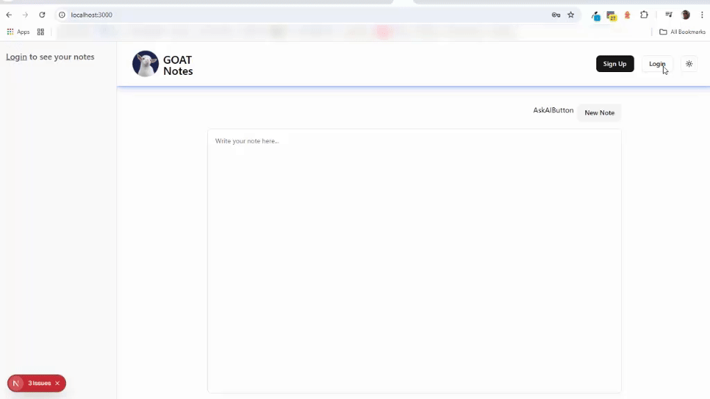
>


## 18. Finish Sidebar (1:29:23)

1. Empezamos con el componente **`SidebarGroupContent.tsx`**,
empezamos cambiando el elemento `<div` por el renderizado de
`<SidebarGroupContentShadCN`, con una importación muy especial:  
```js
...
import { SidebarGroupContent as SidebarGroupContentShadCN } from "@/components/ui/sidebar";
...
function SidebarGroupContent(notes: Props) {
  console.log(notes);
  return <SidebarGroupContentShadCN>Your notes here</SidebarGroupContentShadCN>;
}
```
2. El texto de `Your notes`, lo cambiamos por varios elementos:
```js
import { SearchIcon } from "lucide-react";
...
function SidebarGroupContent(notes: Props) {
  console.log(notes);
  return (
    <SidebarGroupContentShadCN>
      <div className="relative flex items-center">
        <SearchIcon className="absolute left-2 size-4" />
      </div>
      here
    </SidebarGroupContentShadCN>
  );
}
```
3. Debajo del `<SearchIcon`, ponemos in `<Input`:
```js
import { Input } from "./ui/input";
...
function SidebarGroupContent(notes: Props) {
  console.log(notes);
  return (
    <SidebarGroupContentShadCN>
      <div className="relative flex items-center">
        <SearchIcon className="absolute left-2 size-4" />
        <Input
          className="bg-muted pl-8"
          placeholder="Search your notes..."
          value={searchText}
          onChange={(e) => setSearchText(e.target.value)}
        />
      </div>
    </SidebarGroupContentShadCN>
  );
}
```

>[!WARNING]  
>Tenemos algunos errores que mas adelante vamos a corregir:
>* Cannot find name 'searchText'.
>* Cannot find name 'setSearchText'.

4. El `searchText` es un _hook_ te tipo `useState`:
```js
  const [searchText, setSearchText] = useState("");
```
5. Para probarlo debo hacer `[Login]` en una cuenta existente,
y así se ve el cuadro de búsquedas:  
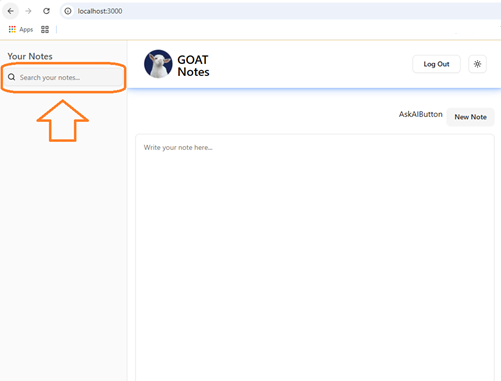.


6. Agrebamos por fuera del `<div` un `SidebarMenu`, con la 
respectiva importación:
```js
      <SidebarMenu className="mt-4">
        
      </SidebarMenu>
```
7. Creamos un _hook_ de tipo `useState` de nombre `localNotes`:
```js
  const [localNotes, setLocalNotes] = useState(notes);
```
8. Ponemos un _hook_ de tipo `useEffect`, con la respectiva
importación:
```js
  useEffect(() => {
    setLocalNotes(notes);
  }, [notes]);
```

9. En una `TERMINAL` instalamos la librería `fuse.js`:
```bash
pnpm add fuse.js -E
```
10. Creamos un _hook_ de tipo `useMemo`y utilizamos la nueva librería de `fuse`, con una importación en mayúsculas:
```js
  const fuse = useMemo(() => {
    return new Fuse(localNotes, {
      keys: ["text"],
      threshold: 0.4, // 1 es _match_ exacto, otros valores son aproximaciones
    });
  }, [localNotes]);
```

>[!WARNING]  
>Tengo un error en este `useMemo`, relacionado con `localNotes`,
> la solución es encerrar entre llaves `{}`, el valor cuando se 
>recibe como parámetro en la función principal:
>```js
>function SidebarGroupContent({notes}: Props) {
>```

>[!NOTE]  
>La razón de usar el `useMemo` es que se renderiza en el `useEffect`
>pero no es necesario, si y solo si, si cambia el valor de 
>`localNotes`.

11. Creamos la constante `filteredNotes` y en un condicional 
ternario, :
```js
  const filteredNotes = searchText
    ? fuse.search(searchText).map((result) => result.item)
    : localNotes;
```

12. Usamos este `filteredNotes`, como el valor a agregar cuando
renderizamos el componente `<SidebarMenu`, con la importación del
renderizado de `<SidebarMenuItem`:
```js
      <SidebarMenu className="mt-4">
        {filteredNotes.map((note) => (
          <SidebarMenuItem
            key={note.id}
            className="group/item"
          ></SidebarMenuItem>
        ))}
      </SidebarMenu>
```
13. Agregamos el renderizado de dos componente, dentro del 
`<SidebarMenuItem`:
    * `<SelectNoteButton`
    * `<DeleteNoteButton`
```js
          <SidebarMenuItem
            key={note.id}
            className="group/item"
          >
            <SelectNoteButton note={note} />
            <DeleteNoteButton noteId={note.id} />
          </SidebarMenuItem>
```
>[!WARNING]  
>Aparece dos errores, puesto que los componentes no existen aun.

14. En el renderizado del componente `<DeleteNoteButton` agregamos
otro elemento que es el llamado a una función:
```js
          <SidebarMenuItem key={note.id} className="group/item">
            <SelectNoteButton note={note} />
            <DeleteNoteButton
              noteId={note.id}
              deleteNoteLocally={deleteNoteLocally}
            />
          </SidebarMenuItem>
```
15. Creamos la función `deleteNoteLocally()`:
```js
  function deleteNoteLocally(noteId: string) {
    setLocalNotes((prevNotes) =>
      prevNotes.filter((note) => note.id !== noteId),
    );
  }
```
16. Creamos los dos componentes faltantes:
    * **`SelectNoteButton.tsx`**
    * **`DeleteNoteButton.tsx`**

17. A ambos les aplicamos el _snipet_ `rfce` y cambiamos el
`import React from "react";` por `"use client";`.
18. En el componente **`SelectNoteButton.tsx`**, definimos un 
tipo `Props`:
```js
"use client";

import { Note } from "@prisma/client";

type Props = {
  note: Note; // "@prisma/client"
};

function SelectNoteButton({ note}: Props) {
  return <div>SelectNoteButton</div>;
}

export default SelectNoteButton;
```
19. En el componente **`DeleteNoteButton.tsx`**, definimos un
tipo `Props`:
```js
"use client";

type Props ={
  noteId: string;
  deleteNoteLocally: (noteId: string) => void;
}

function DeleteNoteButton({noteId, deleteNoteLocally}:Props) {
  return <div>DeleteNoteButton</div>;
}

export default DeleteNoteButton;
```
20. Ahora si Importamos los dos componentes en 
**`SidebarGroupContent.tsx`**.
* Así se ve hasta el momento en el browser:  
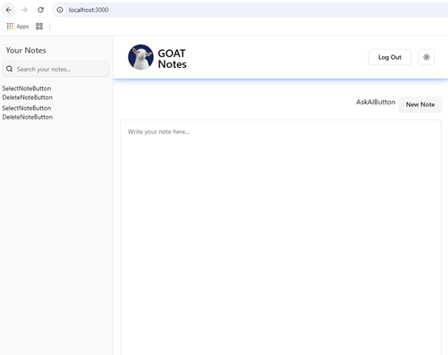  
* Se ven dos(2) `SelectNoteButton` y dos (2) `DeleteNoteButton`,
porque hay dos registros en la base de datos en la tabla `notes`.
*. El filtro tambien funciona.


21. Vamos al componente **`Header.tsx`** y renderizamos un componente
de nombre `<SidebarTrigger`, justo arriba del `<Link` con la
imagen del **`goatius.png`**, y la respectiva importación:
```js
      <SidebarTrigger />
```
22. Agregamos un `className` a este nuevo renderizado:
```js
      <SidebarTrigger className="absolute left-1 top-1" />
```
* El botón aparece arriba-izquierda de la imagen **`goatius.png`** 
y sirve para ocultar o mostrar la barra izquierda.

23. Regresamos al componente **`SelectNoteButton.tsx`** y definimos 
una constante en la función principal, con la respectiva importación:
```js
  const noteId = useSearchParams().get("noteId") || ""; // "next/navigation"
```
24. Definimos un objeto de con valor de ``, y de tipo 
_hook_ `useNote`:
```js
  const { noteText: selectedNoteText } = useNote(); // "@/hooks/useNote"
```
25. Defino una constante para las notas vacías:
```js
const blankNoteText = "EMPTY NOTE";
```
26. Defino una variable `noteText`:
```js
let noteText = localNoteText || blankNoteText;
```
>[!WARNING]  
>Por ahora tengo el error: 
>* Cannot find name 'localNoteText'.

27. Defino un _hook_ de tipo `useState`, para el valor de
`localNoteText`:
```js
const [localNoteText, setLocalNoteText] = useState(note.text);
```
* Recuerde la respectiva importaciónde `useState`.
28. Debajo de la variable `NoteText`, ponemos un condicional:
```js
  if (shouldUseGlobalNoteText) {
    noteText = selectedNoteText || blankNoteText;
  }
```
>[!WARNING]  
>Obtenemos el error:
>* Cannot find name 'shouldUseGlobalNoteText'.

29. Creamos un _hook_ de tipo `useState` para el valor faltante
de `houldUseGlobalNoteText`:
```js
  const [shouldUseGlobalNoteText, setShouldUseGlobalNoteText] = useState(false);
```
30. Creamos un _hook_ de tipo `useEffect`:
```js
  useEffect(() => {
    if (noteId === note.id) {
      setShouldUseGlobalNoteText(true);
    } else {
      setShouldUseGlobalNoteText(false);
    }
  }, [noteId, note.id]);
```
* Recuerden la importación de `useEffect`

31. Creamos otro `useEffect`:
```js
  useEffect(() => {
    if (shouldUseGlobalNoteText) {
      setLocalNoteText(selectedNoteText);
    }
  }, [selectedNoteText, shouldUseGlobalNoteText]);
```
32. Cambiamos el elemento `<div` por renderizar el componente
`<SidebarMenuButton` y la respectiva importación:
```js
  return <SidebarMenuButton>SelectNoteButton</SidebarMenuButton>
```
33. Completamos el renderizado de `<SidebarMenuButton`:
```js
    <SidebarMenuButton
      asChild
      className={`items-start gap-0 pr-12 ${note.id === noteId && "bg-sidebar-accent/50"}`}
    >
      SelectNoteButton
    </SidebarMenuButton>
```
34. Cambiamos el texto `SelectNoteButton` por un `Link` y 
hacemos la importación de `import Link from "next/link";`:
```js
      <Link href={`/?noteId=${note.id}`} className="flex h-fit flex-col"></Link>
```
35. En el `<Link` agregamos un elemento `<p`:
```js
    <SidebarMenuButton
      asChild
      className={`items-start gap-0 pr-12 ${note.id === noteId && "bg-sidebar-accent/50"}`}
    >
      <Link href={`/?noteId=${note.id}`} className="flex h-fit flex-col">
        <p className="w-full truncate overflow-hidden text-ellipsis whitespace-nowrap">
          {noteText}
        </p>
      </Link>
    </SidebarMenuButton>
```
* Así se ven los textos en la barra izquierda:  
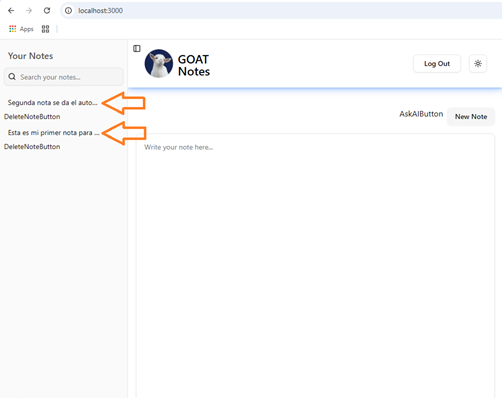


36. Agregamos otro _tag_ `<p`, con lo siguiente:
```js
        <p className="text-muted-foreground text-xs">
          {note.updateAt.toLocaleDateString()}
        </p>
```
* Así salen las fechas:  
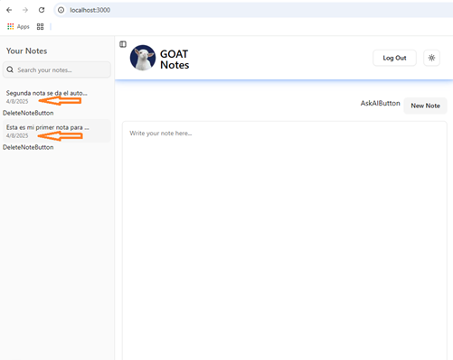


37. En una `TERMINAL` ejecutamos este comando, del sitio
[Alert Dialog](https://ui.shadcn.com/docs/components/alert-dialog)
```bash
pnpm dlx shadcn@latest add alert-dialog
```
38. Vamos al componente **`DeleteNoteButton.tsx`** y copiamos de este 
sitio [Alert Dialog](https://ui.shadcn.com/docs/components/alert-dialog),
para sustituir el contenido del `return`:
```js
function DeleteNoteButton({ noteId, deleteNoteLocally }: Props) {
  return (
    <AlertDialog>
      <AlertDialogTrigger>Open</AlertDialogTrigger>
      <AlertDialogContent>
        <AlertDialogHeader>
          <AlertDialogTitle>Are you absolutely sure?</AlertDialogTitle>
          <AlertDialogDescription>
            This action cannot be undone. This will permanently delete your
            account and remove your data from our servers.
          </AlertDialogDescription>
        </AlertDialogHeader>
        <AlertDialogFooter>
          <AlertDialogCancel>Cancel</AlertDialogCancel>
          <AlertDialogAction>Continue</AlertDialogAction>
        </AlertDialogFooter>
      </AlertDialogContent>
    </AlertDialog>
  );
}
```

39. Del mismo sitio copiamos las importaciones requeridas:
```js
import {
  AlertDialog,
  AlertDialogAction,
  AlertDialogCancel,
  AlertDialogContent,
  AlertDialogDescription,
  AlertDialogFooter,
  AlertDialogHeader,
  AlertDialogTitle,
  AlertDialogTrigger,
} from "@/components/ui/alert-dialog"
```

>[!CAUTION]  
>Muevo el componente **`DeleteNoteButton.tsx`**, a la carpeta
>**"src/components"**, corrijo estos archivos:
>* **`SidebarGroupContext.tsx`**

40. Hacemos unos cambios en el `return` del componente
**`DeleteNoteButton.tsx`**:
```js
  return (
    <AlertDialog>
      <AlertDialogTrigger asChild>
        <Button> <Trash2/></Button>
      </AlertDialogTrigger>
      ...
    </AlertDialog>
  );
```
* Y las respectivas importaciones:
```js
import { Button } from "./ui/button";
import { Trash2 } from "lucide-react";
```
41. En el renderizado del componente `<Button`, le agregamos un
`className`:
```js
      <AlertDialogTrigger asChild>
        <Button
          className="absolute top-1/2 right-2 size-7 -translate-y-1/2 p-0 opacity-0 group-hover/item:opacity-100 [&_svg]:size-3"
          variant="ghost"
        >
          {" "}
          <Trash2 />
        </Button>
      </AlertDialogTrigger>
```
* El comportamiento esperado es que cada vez que paso el mouse por 
la barra izquierda aparece la imagen de la caneca-basura o _trash_
<svg xmlns="http://www.w3.org/2000/svg" width="16" height="16" fill="currentColor" class="bi bi-trash" viewBox="0 0 16 16">
  <path d="M5.5 5.5A.5.5 0 0 1 6 6v6a.5.5 0 0 1-1 0V6a.5.5 0 0 1 .5-.5m2.5 0a.5.5 0 0 1 .5.5v6a.5.5 0 0 1-1 0V6a.5.5 0 0 1 .5-.5m3 .5a.5.5 0 0 0-1 0v6a.5.5 0 0 0 1 0z"/>
  <path d="M14.5 3a1 1 0 0 1-1 1H13v9a2 2 0 0 1-2 2H5a2 2 0 0 1-2-2V4h-.5a1 1 0 0 1-1-1V2a1 1 0 0 1 1-1H6a1 1 0 0 1 1-1h2a1 1 0 0 1 1 1h3.5a1 1 0 0 1 1 1zM4.118 4 4 4.059V13a1 1 0 0 0 1 1h6a1 1 0 0 0 1-1V4.059L11.882 4zM2.5 3h11V2h-11z"/>
</svg>.

42. Cambiamos este texto de `Are you absolutely sure?` por  
`Are you sure you want to delete this note?`.
43. Cambiamos todo este texto de  
`This action cannot be undone. This will permanently delete your`  
`account and remove your data from our servers.`  
por  
`This action cannot be undone. This will permanently delete your note`  
`from our servers.`.
44. Cambiamos el texto de `Continue` dentro del renderizado de
`<AlertDialogAction` por este código
```js
          <AlertDialogAction>
          {isPending ? <Loader2 className="animate-spin" /> : "Delete"}
          </AlertDialogAction>
```
* Recuerda la importación requerida `"lucide-react"` para `Loader2`.
>[!WARNING]  
>Falta definir el valor de `isPending`.
45. Definimos `isPending` como un _hook_ de tipo `useTransaction`:
```js
  const [isPending, startTransition] = useTransition();
```
* Y la respectiva importación de `"react"`.
46. En el renderizado de `<AlertDialogAction`, le definimos unas
acciones y un `className`:
```js
          <AlertDialogAction
            onClick={handleDeleteNote}
            className="bg-destructive text-destructive-foreground hover:bg-destructive/90 w-24"
          >
            {isPending ? <Loader2 className="animate-spin" /> : "Delete"}
          </AlertDialogAction>
```
46. Creamos la función `handleDeleteNote()`:
```js
  function handleDeleteNote() {}
```
47. Empezamos a llenar la nueva función `handleDeleteNote()`:
```js
  function handleDeleteNote() {
    startTransition(async () => {
      const { errorMessage } = await deleteNoteAction(noteId);
    });
  }
```

>[!TIP]  
>Como `deleteNoteAction()`, nos marca error, vamos al archivo 
>**`action/notes`** y creamos la función vacía faltante:
>```js
>export async function deleteNoteAction(noteId: string) {
>  return { errorMessage: null }
>}
>```
>Para ser importada en el componente **`DeleteNoteButton.tsx`**

48. dentro de la función principal `DeleteNoteButton()`, 
ponemos dos _hook_ de tipo `useRouter` y otro `useToast`:
```js
function DeleteNoteButton({ noteId, deleteNoteLocally }: Props) {
  const router = useRouter(); // "next/navigation"
  const { toast } = useToast(); // "@/hooks/use-toast"
```
49. También leemos del parámetro el `noteId`:
```js
  const noteIdParam = useSearchParams().get("noteId") || ""; // "next/navigation"
```
50. En la función `handleDeleteNote()`, ponemos un `toast`, si
no hay `erroMessage`:
```js
      if (!errorMessage) {
        toast({
          title: "Note Deleted",
          description: "You have successfully deleted the note",
          variant: "success",
        });
      }
```
51. Se llama la función que vino en los parámetros de nombre
`deleteNoteLocally()`, dentro de la condición `if (!errorMessage)`:
```js
        // Eliminar la nota localmente **`SidebarGroupContent.tsx`**
        deleteNoteLocally(noteId);
```
52. Si `noteId` es igual a `noteIdParam`, regresamos a la `URL` raíz:
```js
        // Si la nota eliminada es la que está seleccionada, redirigir a la página principal
        if (noteId === noteIdParam) router.replace("/");
```
53. Vamos a completar en el archivo **`actions/notes.ts`**, la
función `deleteNoteAction()`:
```js
export async function deleteNoteAction(noteId: string) {
  try {
    const user = await getUser();
    if (!user) throw new Error("You must be logged in to delete a note");

    await prisma.note.delete({
      where: { id: noteId, authorId: user.id },
    });

    return { errorMessage: null };
  } catch (error) {
    return handleError(error);
  }
}
```

* Verificamos el borrado y esto es lo que pasa:  
  


* También verificar en BD y tan solo queda un registro:  
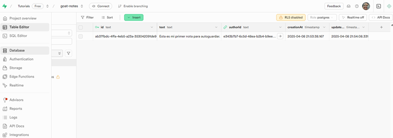


## 19. Add Middleware (1:51:31)

1. Abrimos el archivo **`middleware.ts`** y empezamos a ajustar los
comentarios que dejamos en el paso 
[8. Add Supabase Code](#8-add-supabase-code-03548), quitando el
comentario que empieza en `const supabase = createServerClient(`
hasta el cierre de la creación del servidor, y quito el comentario 
de `!Comentado para no crear aun el servidor de supabase`:
```js
  const supabase = createServerClient(
    process.env.SUPABASE_URL!,
    process.env.SUPABASE_ANON_KEY!,
    {
      cookies: {
        getAll() {
          return request.cookies.getAll();
        },
        setAll(cookiesToSet) {
          cookiesToSet.forEach(({ name, value /*, options*/ }) =>
            request.cookies.set(name, value),
          );
          supabaseResponse = NextResponse.next({
            request,
          });
          cookiesToSet.forEach(({ name, value, options }) =>
            supabaseResponse.cookies.set(name, value, options),
          );
        },
      },
    },
  );
```
2. Agregamos la constante `isAuthRoute`, debajo del que 
se le quitó el comentario:
```js
  const isAuthRoute =
    request.nextUrl.pathname === "/login" ||
    request.nextUrl.pathname === "/sign-up";
```
3. Se agrega una condición basada en `isAuthRoute`:
```js
  // Dependiendo de la ruta, redirigimos al usuario a la página de inicio o a la página de inicio de sesión
  if (isAuthRoute) {
    const {
      data: { user },
    } = await supabase.auth.getUser();
    if (user) {
      return NextResponse.redirect(
        new URL("/", process.env.NEXT_PUBLIC_BASE_URL),
      );
    }
  }
```
4. Cargamos en un objeto los datos provenientes de 
`new URL(request.url);`:
```js
  // Cargamos el token de acceso y lo guardamos en la cookie
  const { searchParams, pathname } = new URL(request.url);
```
5. Encerramos en un condicional lo comentado debajo del texto
`!Comentado para evitar redirecionamento para login`, quitando
ese texto y descomentando el código que sigue:
```js
  if (!searchParams.get("noteId") && pathname === "/") {
    const {
      data: { user },
    } = await supabase.auth.getUser();
  }
```
6. Dentro de este nuevo condicional preguntamos por el `user`:
```js
    if (user) {
      const { newestNoteId } = await fetch(
        `${process.env.NEXT_PUBLIC_BASE_URL}/api/fetch-newest-note?userId=${user.id}`,
      ).then((res) => res.json());
    }
```
7. Dentro de la misma condicional del `user`, preguntamos por
el valor obtenido de `newestNoteId`, así va este gran número de 
condicionales anidados:
```js
  if (!searchParams.get("noteId") && pathname === "/") {
    const {
      data: { user },
    } = await supabase.auth.getUser();

    if (user) {
      const { newestNoteId } = await fetch(
        `${process.env.NEXT_PUBLIC_BASE_URL}/api/fetch-newest-note?userId=${user.id}`,
      ).then((res) => res.json());

      if (newestNoteId) {
        const url = request.nextUrl.clone();
        url.searchParams.set("noteId", newestNoteId);
        return NextResponse.redirect(url);
      }
    }
  }
```
8. Hacemos el `else`, del condicional del valor `newestNoteId`:
```js
      if (newestNoteId) {
        const url = request.nextUrl.clone();
        url.searchParams.set("noteId", newestNoteId);
        return NextResponse.redirect(url);
      } else {
        const { noteId } = await fetch(
          `${process.env.NEXT_PUBLIC_BASE_URL}/api/create-new-note?userId=${user.id}`,
          {
            method: "POST",
            headers: {
              "Content-Type": "application/json",
            },
          },
        ).then((res) => res.json());
        const url = request.nextUrl.clone();
        url.searchParams.set("noteId", noteId);
        return NextResponse.redirect(url);
      }
```
>[!WARNING]  
>Sale un error relacionado con la no existencia de los api
> que se tratan de acceder en el **`middleware.ts`**:
>```diff
>-GET /api/fetch-newest-note?userId=e343b7b7-6c5d-48ea-b2b4-b9eecfa824f3 404 in 14787ms
>``` 
9. Creamos en la carpeta **"src/app"**, el siguiente archivo:
**`api/create-new-note/route.ts`**, y le ponemos este código:
```js
import { prisma } from "@/db/prisma";
import { NextRequest, NextResponse } from "next/server";

export async function POST(request: NextRequest) {
  const { searchParams } = new URL(request.url);
  const userId = searchParams.get("userId") || "";

  const { id } = await prisma.note.create({
    data: {
      authorId: userId,
      text: "",
    },
  });

  return NextResponse.json({
    noteId: id,
  });
}
```
10. Creamos otro arhivo en la carpeta **"src/app"**, con el nombre
**`api/fetch-newest-note/route.ts`** y este código:
```js
import { prisma } from "@/db/prisma";
import { NextRequest, NextResponse } from "next/server";

export async function GET(request: NextRequest) {
  const { searchParams } = new URL(request.url);
  const userId = searchParams.get("userId") || "";

  const newestNoteId = await prisma.note.findFirst({
    where: {
      authorId: userId,
    },
    orderBy: {
      createdAt: "desc",
    },
    select: {
      id: true,
    },
  });

  return NextResponse.json({
    newestNoteId: newestNoteId?.id,
  });
}
```

>[!IMPORTANT]  
>### Cambiamos el **`db/schema.prisma`**.
>1. Se detine la ejecución de la `TERMINAL` de `pnpm dev`.
>2. Cambiamos el archivo **`db/schema.prisma`**, con los nombres
>para las fechas.  
>Cambiamos `creationAt` por `createdAt` y
>la de `updateAt` por `updatedAt`:
>```ini
>datasource db {
>  provider = "postgresql"
>  url      = env("DATABASE_URL")
>}
>
>generator client {
>  provider = "prisma-client-js"
>}
>
>model Note {
>  id        String    @id @default(uuid())
>  text      String
>  author    User?     @relation(fields: [authorId], references: [id])
>  authorId  String?
>  createdAt DateTime @default(now())
>  updatedAt DateTime  @updatedAt   @default(now())
>}
>
>model User {
>  id        String    @id @default(uuid())
>  email     String    @unique
>  posts     Note[]
>  createdAt DateTime @default(now())
>  updatedAt DateTime  @updatedAt   @default(now())
>}
>```
>3. Borramos la carpeta **"src/db/migrations"**.
>4. Borramos la carpeta **"node_modules/goat-notes"**.
>5. Borramos la carpeta **"node_modules/@prisma/client"**.
>6. Vamos a la página de `Supabase` y borramos las tablas en
>`Database`:  
>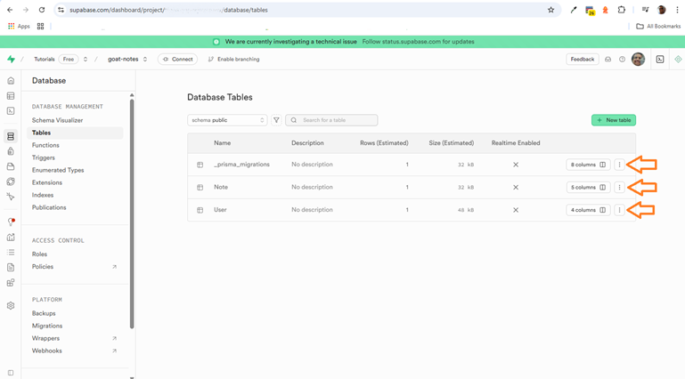
>
>
>
>7. Borramos de la página de `Supabase` los usuarios de 
>`Authentication`:  
>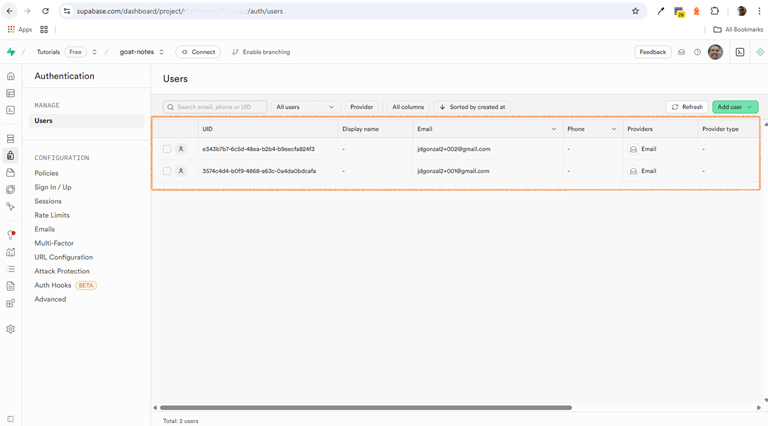
>
>
>
>8. Ejecutamos estos comandos en la `TERMINAL`:
>```bash
>pnpm prisma:generate
>pnpm prisma:migrate
>```
>* Completamos el texto requerido con la palabra `init`.
>9. Revisamos que aparezca la carpeta **"src/db/migrations"**.
>10. Revisamos en `Supabase`, que existan de nuevo las tres tablas:  
>").
>
>
>
>11. Corregimos estos dos archivos con los nombres de los campos
>que recién cambiamos:
>     * **`AppSidebar.tsx`**
>     * **`SelectNoteButton.tsx`**
>12. Volvemos a ejecutar en la `TERMINAL`:
>```bash
>pnpm dev
>```

>[!WARNING]  
>* Si sale un error cuando se intenta levantar la página es probable
>que se requiera borrar las `cookies`, dando clic derecho y luego
>`clear`:  
>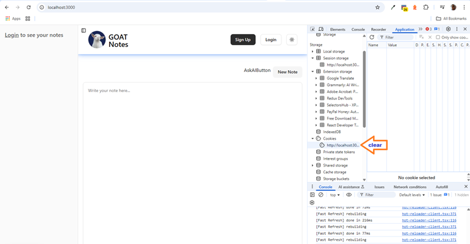
>
>
>* Hagamos de nuevo `[Sign Up]` y `[Login]`.
>* Revise que si le llegue el correo para validar el usuario.

>[!CAUTION]  
>Veo que hizo cambios en:
> * **`package.json`**
> * **`pnpm-lock.yaml`**
>
>En el `git` o el `Sourcetree` restauro sin cambios y borro
>en **"node_modules"**, la carpeta **"prisma"**.
>
>¡Ojo!, no se borra al final la **"@prisma"**.


## 20. Add AskAIButton (1:59:43)

1. De este sitio 
[Dialog](https://ui.shadcn.com/docs/components/dialog)
en una `TERMINAL` ejecutamos este comando:
```bash
pnpm dlx shadcn@latest add dialog
```
2. Del sitio anterior copiamos el código del `return` en el
componente **`AskAiButton`**, cambiamos todo el `return`, y 
borramos el `console.log`:
```js
function AskAIButton({ user }: Props) {
  return (
    <Dialog>
      <DialogTrigger asChild>
        <Button variant="outline">Edit Profile</Button>
      </DialogTrigger>
      <DialogContent className="sm:max-w-[425px]">
        <DialogHeader>
          <DialogTitle>Edit profile</DialogTitle>
          <DialogDescription>
            Make changes to your profile here. Click save when you're done.
          </DialogDescription>
        </DialogHeader>
        <div className="grid gap-4 py-4">
          <div className="grid grid-cols-4 items-center gap-4">
            <Label htmlFor="name" className="text-right">
              Name
            </Label>
            <Input id="name" value="Pedro Duarte" className="col-span-3" />
          </div>
          <div className="grid grid-cols-4 items-center gap-4">
            <Label htmlFor="username" className="text-right">
              Username
            </Label>
            <Input id="username" value="@peduarte" className="col-span-3" />
          </div>
        </div>
        <DialogFooter>
          <Button type="submit">Save changes</Button>
        </DialogFooter>
      </DialogContent>
    </Dialog>
  );
}
```
3. Del mismo sitio pegamos las importaciones respectivas:
```js
import { Button } from "@/components/ui/button";
import {
  Dialog,
  DialogContent,
  DialogDescription,
  DialogFooter,
  DialogHeader,
  DialogTitle,
  DialogTrigger,
} from "@/components/ui/dialog";
import { Input } from "@/components/ui/input";
import { Label } from "@/components/ui/label";
```
4. Damos clic en el nuevo botón de `[Edit Profile]` y obtenemos
esto:  
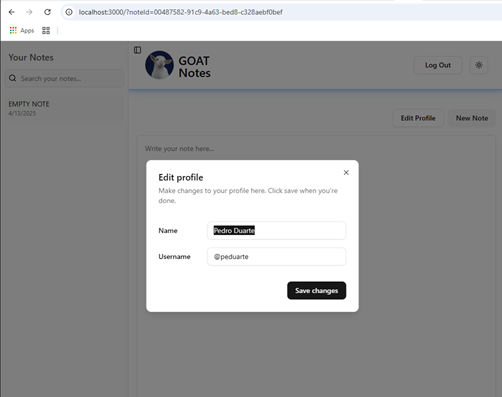


5. Agregamos un _hook_ de tipo `useState` para el valor `open`:
```js
  const [open, setOpen] = useState(false);
```
* Importamos el valor requerido de `"react"`.

6. En el renderizado de `<Dialog` ponemos esto:
```js
    <Dialog open={open} onOpenChange={handleOnOpenChange}>
```
7. Creamos la función faltante `handleOnOpenChange()`:
```js
  function handleOnOpenChange(isOpen: boolean) {
    if (!user) {
      router.push("/login");
    }
  }
```
8. Definimos a `router` con el _hook_ de `useRouter`:
```js
  const router = useRouter(); // "next/navigation"
```
9. Hacemos el `else` al condicional de la función 
`handleOnOpenChange()`:
```js
  function handleOnOpenChange(isOpen: boolean) {
    if (!user) {
      router.push("/login");
    } else {
      if (isOpen) {
        // TODO: Si esta abierto y con el usuario
      }
      setOpen(isOpen);
    }
  }
```
10. Creamos tres _hook_ de tipo `useState`:
```js
  const [questionText, setQuestionText] = useState("");
  const [questions, setQuestions] = useState<string[]>([]);
  const [responses, setResponses] = useState<string[]>([]);
```
11. Cambiamos el `// TODO: Si esta abierto y con el usuario`
por la definición de valores para las tres nuevos _hook_:
```js
  function handleOnOpenChange(isOpen: boolean) {
    if (!user) {
      router.push("/login");
    } else {
      if (isOpen) {
        setQuestionText("");
        setQuestions([]);
        setResponses([]);
      }
      setOpen(isOpen);
    }
  }
```
12. Definimo un _hook_ de tipo `useTransition`:
```js
  const [isPending, startTransition] = useTransition();
```
13. Creamos otros dos _hook_ de tipo `useRef`, y la respectiva
importación de `"react"`:
```js
  const textareaRef = useRef<HTMLTextAreaElement>(null);
  const contentRef = useRef<HTMLDivElement>(null);
```
14. Creamos la función de nombre `handleInput()`:
```js
  // Cuando se ingresa texto en el textarea, se ajusta el tamaño del textarea automáticamente
  function handleInput() {
    const textarea = textareaRef.current;
    if (!textarea) return;

    textarea.style.height = "auto";
    textarea.style.height = `${textarea.scrollHeight}px`;
  }
```
15. Creamos otra función de nombre `handleClickInput()`:
```js
  // Con el clic en cualquier parte, se enfoca el textarea  
  function handleClickInput() {
    textareaRef.current?.focus();
  }
```
16. Creamos otras tres de nombres `handleSubmit()`, 
`scrollToBottom()` y `handleKeyDown()`:
```js
  // Enviar el mensaje
  function handleSubmit() {
    console.log("handleSubmit");
  }

  // Cuando se va hacia abajo, se desplaza hacia abajo el contenedor de mensajes
  function scrollToBottom() {
    contentRef.current?.scrollTo({
      top: contentRef.current.scrollHeight,
      behavior: "smooth",
    });
  }

  //Cuando se presiona la tecla Enter, se envía el mensaje
  function handleKeyDown(e: React.KeyboardEvent<HTMLTextAreaElement>) {
    if (e.key === "Enter" && !e.shiftKey) {
      e.preventDefault();
      handleSubmit();
    }
  }
```

17. El primer `<Button` cambiamos el `variant` de `"outline"` a
`"secondary"` y el texto de `Edit Profil` por `Ask AI`:
```js
        <Button variant="secondary">Ask AI</Button>
```
18. Cambiamos el estilo del renderizado de `<DialogContent` y se
agrega un elemento `ref=`:
```js
      <DialogContent
        className="custom-scrollbar flex h-[85vh] max-w-4xl flex-col overflow-y-auto"
        ref={contentRef}
      >
```
19. Cambiamos el texto del renderizado de `<DialogTitle` por
`Ask AI About Your Notes`.
20. El texto del renderizado de `<DialogDescription`, lo cambiamos
por `Out AI can answer questions about all of your notes.`.
21. Borramos o comentamos todo lo que hay entre `</DialogHeader>` y
`</DialogContent>`.
22. Se borra o comenta cuando se importa el `DialogFooter,`.
23. Debajo de `</DialogHeader>` y antes del texto comentado, 
empezamos con un `<div` y algo mas de código:
```js
        <div>
          {questions.map((question, index) => (
            <Fragment key={index}>
              <p>{question}</p>
              {responses[index] && (
                <p
                  className="bot-response text-muted-foreground text-sm"
                  dangerouslySetInnerHTML={{ __html: responses[index] }}
                />
              )}
            </Fragment>
          ))}
        </div>
```
* Importamos `Fragment` de `"react"`.
24. Agregamos un `className` el primer elemento `<p`:
```js
              <p className="bg-muted text-muted-foreground ml-auto max-w-[60%] rounded-md px-2 py-1 text-sm">
                {question}
              </p>
```
25. Agregamos un `className` el elemento `<div`:
```js
        <div className="mt-4 flex flex-col gap-8">
```
26. Justo antes de cerrar el `</div>`, ponemos una pregunta
basada en `isPending`:
```js
          {isPending && <p className="animate-pulse text-sm">Thinking...</p>}
```
27. Creamos otro elemento `<div` debajo del cierre de `</div>` y antes de los comentarios, con un `className` y un elemento
`onClick`:
```js
        <div
          className="mt-auto flex cursor-text flex-col rounded-lg border p-4"
          onClick={handleClickInput}
        ></div>
```
28. Dentro de este segundo `<div` agregamos un renderizado de 
`<Textarea`, con estos elementos:
```js
          <Textarea
            ref={textareaRef}
            placeholder="Ask me anything about your notes..."
            className="placeholder:text-muted-foreground resize-none rounded-none border-none bg-transparent p-0 shadow-none focus-visible:ring-0 focus-visible:ring-offset-0"
          />
```
* Y la respectiva importación de `"./ui/textarea"`.
29. Agregamos mas elementos a ese `<Textarea`:
```js
            style={{
              minHeight: "0",
              lineHeight: "normal",
            }}
            rows={1}
            onInput={handleInput}
            onKeyDown={handleKeyDown}
            value={questionText}
            onChange={(e) => setQuestionText(e.target.value)}
```
30. Debajo de este `<Textarea`, agregamos el renderizado de
un `<Button`:
```js
          <Button className="ml-auto size-8 rounded-full">
            <ArrowUpIcon className="text-background" />
          </Button>
```
* Y la respectiva importación de `"lucide-react"`.
31. Cuando se presiona el botón `[Ask AI]`, aparece el
cuadro de diálogo con esto:  
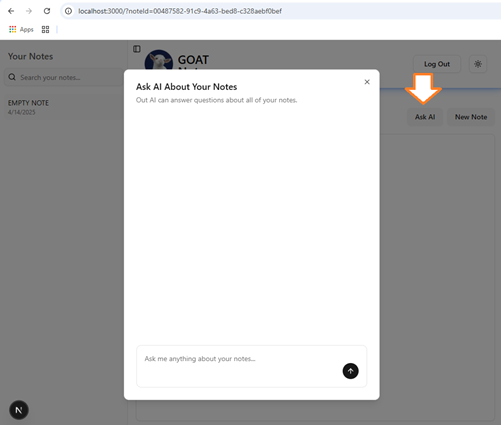


32. En la función `handleSubmit()`, hacemos estos cambios:
```js
    // Si esta vacío, no se hace nada
    if (!questionText.trim()) return;

    const newQuestions = [...questions, questionText];
    setQuestions(newQuestions);
    setQuestionText("");
    setTimeout(scrollToBottom, 100); // Hay que dar un tiempo para que se vea el mensaje antes de que se envíe la respuesta
```

33. Añadimos a esta función un `startTransition`:
```js
    startTransition(async () => {
      const response = await askAIAboutNotesAction(newQuestions, responses);
      setResponses((prev) => [...prev, response]);

      setTimeout(scrollToBottom, 100); // Esperar igual
    });
```
>[!WARNING]  
>El error es porque falta construir esta acción 
>`askAIAboutNotesAction`.

34. Abrimos el archivo **`actions/notes.tsx`**, agregamos la 
función `askAIAboutNotesAction()`:
```js
export async function askAIAboutNotesAction(
  newQuestions: string[],
  responses: string[],
) {
  const user = await getUser();
  if (!user) throw new Error("You must be logged in to ask AI questions");
}

  return null || ""; // Ponemos esto de forma temporal
```
35. Regresamos al componente **`AskAIButton.ts`** y realizamos
la importación faltante:
```js
import { askAIAboutNotesAction } from "@/actions/notes";
```
36. En la función `askAIAboutNotesAction()` de 
**`actions/notes.tsx`**, copiamos un _fetch_ de `prisma` y hacemos
unso cambios:
```js
  // Aquí se obtienen las notas del usuario
  const notes = await prisma.note.findMany({
    where: { authorId: user.id },
    orderBy: { createdAt: "desc" },
    select: { text: true, createdAt: true, updatedAt: true },
  });
```
37. Si no hay notas, se devuelve un mensaje:
```js
  // Si no hay notas, se devuelve un mensaje
  if (notes.length === 0) {
    return "You don't have any notes yet.";
```
38. Si hay notas, debemos hacer un formato que la `A.I.` pueda
entender fácilemente:
```js
  //Si hay notas, se hace un formato que la `A.I.` pueda entender
  const formattedNotes = notes
    .map((note) =>
      `
      Text: ${note.text}
      Created at: ${note.createdAt}
      Last updated: ${note.updatedAt}
      `.trim(), // este trim al final para evitar espacios innecesarios
    )
    .join("\n");
```
39. Creamos una constante de nombre `messages`, para  explicarle a
`Chat-GPT` que necesitamos exactamente:
```js
  // Para explicarle a `Chat-GPT` que necesitamos exactamente
  const messages: ChatCompletionMessageParam[] = [
    {
      role: "developer",
      content: `
            You are a helpful assistant that answers questions about a user's notes. 
            Assume all questions are related to the user's notes. 
            Make sure that your answers are not too verbose and you speak succinctly. 
            Your responses MUST be formatted in clean, valid HTML with proper structure. 
            Use tags like <p>, <strong>, <em>, <ul>, <ol>, <li>, <h1> to <h6>, and <br> when appropriate. 
            Do NOT wrap the entire response in a single <p> tag unless it's a single paragraph. 
            Avoid inline styles, JavaScript, or custom attributes.
            
            Rendered like this in JSX:
            <p dangerouslySetInnerHTML={{ __html: YOUR_RESPONSE }} />
      
            Here are the user's notes:
            ${formattedNotes}
            `,
    },
  ];
```
>[!WARNING]  
>Tenemos un error por que no sabe que es `ChatCompletionMessageParam`.
>
>### Instalamos la libreria de [`OpenAI`](https://www.npmjs.com/package/openai)

40. Se ejecuta este comando en la `TERMINAL`:
```bash
pnpm add openai -E
```

41. Regresamos al archivo **`actions/notes.tsx`** y completamos}
la importación faltante:
```js
import { ChatCompletionMessageParam } from "openai/resources/index.mjs";
```

42. Creamos un archivo en la carpeta **"src"** de nombre
**`openai/index.ts`** con este código:
```js
import OpenAI from "openai";

const openai = new OpenAI({
  apiKey: process.env.OPENAI_API_KEY,
});

export default openai;
```

>[!CAUTION]  
>Se corrige el nombre en el archivo **`.env.local`**, de
>`OPENAI_API_KEY`.

43. Revisamos que el archivo **`.env.local`**, si tenga este 
elemento del 
[13. Set Up OpenAI Account](#13-set-up-openai-account-10911):  
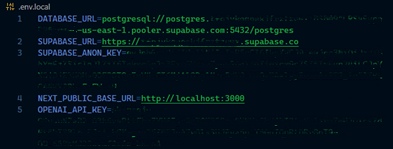 


44. En el archivo **`actions/notes.tsx`**, debajo de la constante
`messages`, pornemos un `for`, para cargar `messages`:
```js
  for (let i = 0; i < newQuestions.length; i++) {
    messages.push({ role: "user", content: newQuestions[i] });
    if (responses.length > i) {
      messages.push({ role: "assistant", content: responses[i] });
    }
  }
```
45. Debajo de ese `for` creamos la constante `completion`
que cargamos de `openai.chat.completions.create(` e
importamos de `"@/openai"`:
```js
  const completion = await openai.chat.completions.create({ // "@/openai"
    model: "gpt-4o-mini",
    messages,
  });
```
46. Por útlimo cambiamos el `return` temporal de la función 
`askAIAboutNotesAction()` por este:
```js
  return completion.choices[0].message.content || "A problem has occurred";
```

47. De este sitio [**`ai-response.css`**](https://github.com/ColeBlender/goat-notes/blob/main/src/styles/ai-response.css), descargamos el archivo y lo ponemos en 
la carpeta **"src/styles"**.

48. Vamos a importar este archivo dentro de **`AskAIButton.tsx`**:
```js
import "@/styles/ai-response.css";
```

>[!NOTE]  
>### Así se ve la ejecución con la `A.I.`:
>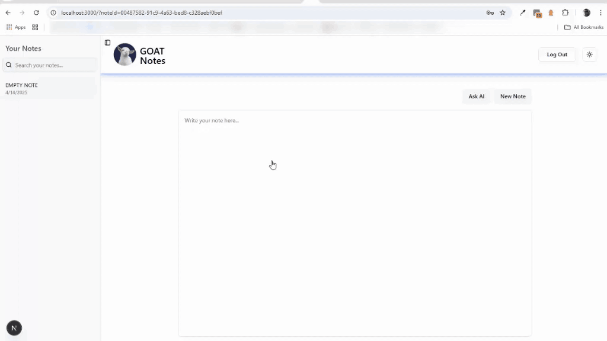
